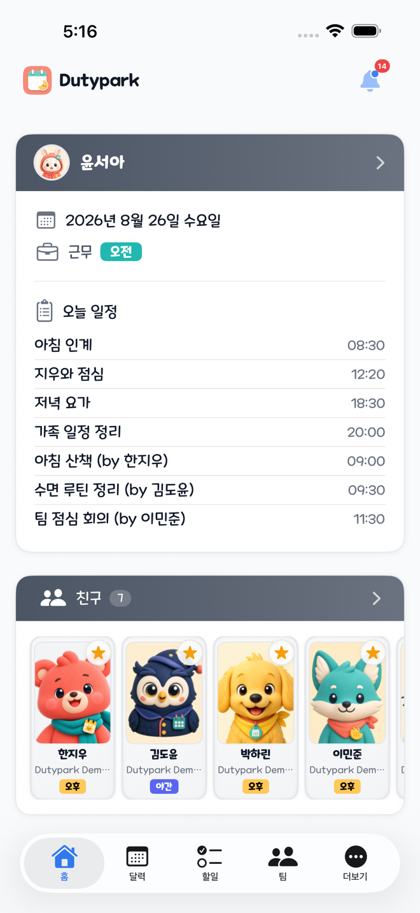
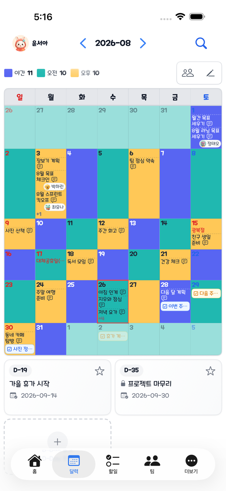
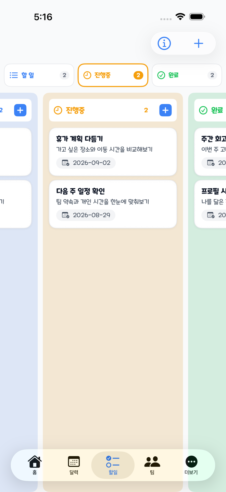
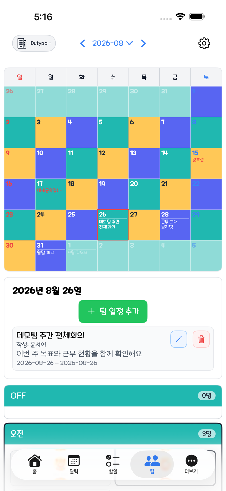
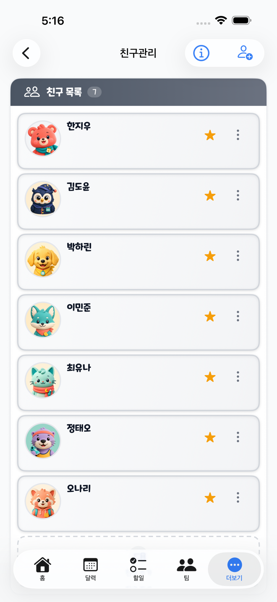

# Dutypark

[한국어](README.ko.md) | [English](README.md)

[https://dutypark.o-r.kr](https://dutypark.o-r.kr)

<a href="#" target="_blank"></a> <a href="#" target="_blank"></a> <a href="#" target="_blank"></a> <a href="#" target="_blank"></a> <a href="#" target="_blank"></a> <a href="#" target="_blank"></a> <a href="#" target="_blank"></a>

> **나와 소중한 사람들을 위한 소셜 캘린더**

---

## 왜 Dutypark인가요?

일정은 단순히 근무만이 아닙니다. 데이트를 계획하려는 연인, 서로의 스케줄에 맞춰야 하는 가족, 응원하는 팀의 경기 일정을 공유하는 친구들까지.

**Dutypark은 당신의 일상을 소중한 사람들과 연결합니다.** 일정을 공유하고, 함께 계획하고, 서로의 하루를 알 수 있어요.

### 누구를 위한 서비스인가요?

| 사용자 | 얻는 가치 |
|:-------|:----------|
| **가족** | 배우자, 아이들과 일정 공유 — 등하원, 가족 이벤트를 놓치지 않게 |
| **직장인** | 근무일과 연차를 관리하고, 가족에게 공유해서 언제 쉬는지 알려주기 |
| **스포츠 팬** | 응원팀 일정 관리 — 홈/원정, 경기 시간, 장소, 상대팀까지 |
| **교대근무자** | 엑셀로 근무표 업로드, 가족과 공유, 동료와 대타 조율 |
| **부모** | 어린이집 등하원, 학교 행사, 주말 일정을 한 곳에서 |

---

## 핵심 경험

### 의도를 담은 공유

모든 사람에게 모든 것을 보여줄 필요는 없습니다. Dutypark은 **네 단계의 프라이버시**를 제공합니다:

- **전체 공개** — 누구나 볼 수 있음
- **친구 공개** — 승인된 친구만 볼 수 있음
- **가족 공개** — 가장 가까운 가족에게만
- **나만 보기** — 오직 나만

일정에 친구를 태그하세요. 그들의 대시보드에 바로 나타납니다. "카톡 봤어?" 물어볼 필요 없이.

### 나만의 캘린더

- **근무 캘린더** — 색상으로 구분된 근무표, 빈 날은 자동으로 휴무 표시
- **일정 관리** — 약속, 모임, 할 일을 추가하고 AI가 시간을 자동 추출
- **투두 보드** — 드래그 앤 드롭으로 정리되는 할 일 목록
- **디데이 카운트다운** — 기념일, 마감일, 중요한 날을 잊지 않도록

### 함께 연결되기

- **대시보드** — 오늘 내 근무와 친구/가족의 일정을 한 화면에서
- **알림** — 누군가 나를 태그하거나 친구 요청을 보내면 바로 알림
- **팀 보기** — 팀 전체 근무표를 한눈에, 관리자 권한으로 설정

## 네이티브 iOS 오프라인 모드

네이티브 iPhone 앱은 계정별 오프라인 모드를 제공합니다. 이는 웹 PWA와
별개의 기능입니다. iOS는 최근 서버에서 확인된 계정과 로컬 캘린더·할 일
데이터를 다시 열 수 있지만, 현재 웹 서비스 워커는 푸시, 알림 클릭 이동,
배지, 로케일 데이터만 처리합니다. 웹 앱은 앱 셸이나 임의의 API 응답을
오프라인용으로 캐시하지 않습니다. 자세한 내용은
[`frontend/README.md`](frontend/README.md#pwa-and-push)를 참고하세요.

### iOS에 로컬로 보관되는 데이터

오프라인 데이터는 앱의 Application Support 디렉터리 아래
`Dutypark/Offline/accounts/<memberID>/`에 저장됩니다. 계정별로 분리되며
다음 데이터를 포함합니다.

- 마지막으로 서버에서 확인한 프로필 스냅샷, 친구 메타데이터, 디데이;
- 캘린더 격자, 일정, 근무, 한국 공휴일, 비교 멤버 근무를 포함한 월별
  캘린더 스냅샷;
- 할 일 보드와 로컬에서 동기화를 기다리는 생성 작업.

캘린더 캐시는 현재 월을 기준으로 이전 6개월과 이후 6개월을 포함한
13개월의 롤링 범위를 유지합니다. 캐시된 멤버 스냅샷에는 OAuth 제공자
식별자와 access/refresh 토큰을 저장하지 않습니다. 일반 로그인 계정(관리자
대리 계정 제외)은 최대 30일 동안 저장된 신원 정보로 오프라인 복원을
시도할 수 있지만, 이는 로컬 스냅샷일 뿐 서버 세션이 아직 유효하다는
뜻은 아닙니다.

### 인터넷 연결 없이 가능한 작업

오프라인에서는 캐시된 캘린더와 할 일 화면을 읽을 수 있습니다. 영속적으로
대기열에 넣을 수 있는 쓰기는 일반 일정과 할 일의 신규 생성뿐입니다.

- 일정은 제목/내용, 설명, 공개 범위, 시작·종료 시간을 저장할 수 있습니다.
- 할 일은 제목, 내용, 상태, 마감일을 저장할 수 있습니다.
- 대기 중인 생성 작업에는 로컬 UUID가 부여되며 동기화가 끝날 때까지
  임시 항목으로 화면에 남습니다.

태그, 첨부파일, AI 시간 파싱, 수정, 삭제, 근무 변경, 디데이 변경, 친구·팀
작업, 알림 및 그 밖의 온라인 전용 변경은 인터넷 연결이 필요합니다. 홈,
소셜, 팀, 알림 루트 화면은 오프라인에서 온라인 연결 필요 상태를
표시합니다.

네트워크가 복구되면 iOS 동기화 코디네이터가 생성 순서대로 대기열을
처리합니다. 서버는 소유자와 콘텐츠 필드를 기준으로 중복 생성을 억제합니다.
일정은 내용, 설명, 시작 시각, 종료 시각을 비교하고, 할 일은 유효 상태,
제목, 내용을 비교합니다. 일정 공개 범위와 할 일 마감일은 의도적으로
중복 식별 기준에 포함하지 않습니다. 일시적인 전송/디코딩 오류와 HTTP
408, 425, 429, 5xx 응답은 5초부터 최대 5분까지 지수 백오프로 재시도합니다.
검증·권한 관련 4xx 응답은 영구 실패로 기록되어 사용자가 명시적으로
재시도해야 하며, 인증 오류는 세션 경계에서 처리합니다.

로그아웃이나 계정 전환 시 해당 계정의 캐시와 outbox를 삭제합니다. 진행 중인
작업은 인증 세대(generation)로 보호되어 다음 계정에 적용되지 않습니다.
캐시 데이터는 오래된 상태일 수 있고, 동기화가 끝난 뒤에는 서버 데이터가
기준이 됩니다. 오프라인 모드는 수정·삭제에 대한 충돌 없는 동기화를
보장하지 않습니다.

## 데모 데이터와 스크린샷 워크플로

저장소는 실제 앱에서 캡처한 README 이미지와 App Store 제출용 아트워크를
분리합니다. 미리보기를 선택하면 원본 크기 캡처를 열 수 있습니다.

| 홈 | 캘린더 | 할 일 | 팀 | 소셜 |
|:---:|:---:|:---:|:---:|:---:|
| [](docs/screenshots/readme/home.png) | [](docs/screenshots/readme/calendar.png) | [](docs/screenshots/readme/todo.png) | [](docs/screenshots/readme/team.png) | [](docs/screenshots/readme/social.png) |

데모 세트를 갱신하는 순서는 다음과 같습니다.

1. 로컬 Docker MySQL과 로컬 백엔드/프론트엔드만 사용합니다. 운영 서비스에
   데모 자격 증명이나 개인 데이터를 넣지 않습니다.
2. 마커로 식별할 수 있는 데모 계정 하나, 팀, 여러 친구 계정을 만들고,
   Asia/Seoul 기준 현재 날짜의 근무와 공유 일정, 캘린더 한 달치 일정,
   상태별 할 일, 친구 관계, 태그/알림 이벤트, 미래 디데이를 채웁니다.
   안전하게 재생성할 수 있도록 마커와 계정 목록을 로컬 전용 seed
   workflow에 기록합니다.
3. 저장소의 이미지 생성 workflow로 통일감 있는 캐릭터 프로필을 만들고,
   인증된 프로필 사진 업로드 흐름으로 각 계정에 등록합니다. 사진 버전이
   반영된 뒤 태그·친구 이벤트를 발생시켜야 알림의 행위자 스냅샷과 화면의
   프로필 사진이 일치합니다.
4. 가공하지 않은 실제 앱 UI를 README 이미지로 캡처합니다. 원본 캡처와
   마케팅 합성본은 분리하고, 각 파일에 로케일·앱 빌드·기기·캡처 날짜를
   함께 기록합니다.

한국어와 영어 App Store 캡처는 서로 다른 로컬 데모 데이터셋을 사용하며,
각 캡처 실행은 먼저 로그아웃한 뒤 해당 언어의 소유자 계정으로 로그인합니다.

App Store 제출물은 한국어와 영어 원본을 `docs/app-store/raw/{ko,en}/`에,
생성 장식은 `docs/app-store/generated/`에, 최종 합성본은
`docs/app-store/final/{ko,en}/`에 별도로 관리합니다. 자세한 흐름은
[`docs/app-store/README.md`](docs/app-store/README.md)를 참고하세요. 실제 앱 캡처를
기준으로 사용하며, 생성 이미지는 바깥 캔버스·마스코트·장식 스티커만
제공해야 합니다. 생성 이미지가 UI 텍스트, 아이콘, 상태 표시줄, 실제
데이터를 다시 그리거나 바꾸어서는 안 됩니다. 현재 iPhone 제출 기준으로
6.9인치 세로 캔버스 `1320x2868`을 사용하고, 제출물을 준비하거나 교체할
때는 Apple의 [스크린샷 규격](https://developer.apple.com/help/app-store-connect/reference/app-information/screenshot-specifications/)
과 [업로드 안내](https://developer.apple.com/help/app-store-connect/manage-app-information/upload-app-previews-and-screenshots/)
를 확인합니다.

---

## 주요 기능

### 일정 & 공유

| 기능 | 설명 |
|:-----|:-----|
| **스마트 공개 설정** | 4단계 프라이버시 (전체/친구/가족/나만) — 일정마다 세밀하게 조절 |
| **친구 태그** | 일정에 친구를 태그하면 대시보드에 표시되고 알림 발송 |
| **가족 모드** | 혈연관계와 가장 가까운 사람들을 위한 특별한 공개 설정 |
| **엑셀 업로드** | 병원/매장 근무표 템플릿을 그대로 일괄 업로드 (SungsimCake 파서) |
| **AI 시간 파싱** | "오후 3시~5시 회의" 같은 자연어에서 비동기 Gemini 큐로 시간 자동 추출 |
| **순서 재정렬** | 같은 날의 일정을 드래그로 재정렬, 순서 저장 |

### 개인 생산성

| 기능 | 설명 |
|:-----|:-----|
| **디데이 카운트다운** | 기념일, 마감일, 중요한 날 — 공개 여부도 선택 가능 |
| **칸반 투두 보드** | 다중 상태 컬럼 (BACKLOG/TODO/DOING/DONE/CLOSED) 드래그 앤 드롭 |
| **일정 검색** | 전체 텍스트 검색으로 원하는 날짜로 바로 이동, 페이지네이션 지원 |
| **프로필 사진** | 프로필 사진 업로드 및 크롭, 자동 썸네일 생성 |
| **첨부파일** | 일정에 파일 첨부, 재개 가능한 업로드, 자동 썸네일 |

### 팀 협업

| 기능 | 설명 |
|:-----|:-----|
| **팀 캘린더** | 모든 팀원의 근무를 색상별로 한눈에 |
| **관리자 컨트롤** | 멤버 초대/제거, 근무 유형과 색상 설정 |
| **일괄 업로드 템플릿** | 엑셀 업로드를 위한 설정 가능한 배치 템플릿 (SungsimCake 형식) |
| **팀 일정** | 팀 전체에 보이는 공지사항과 이벤트 |
| **시프트 보기** | 누가 어떤 근무인지 일별로 한눈에 확인 |

### 플랫폼 & 연동

| 기능 | 설명 |
|:-----|:-----|
| **카카오 + 네이버 로그인** | 한국 사용자를 위한 소셜 로그인과 SSO 온보딩 |
| **공휴일 동기화** | 공공데이터포털에서 한국 공휴일 자동 연동 (캐시 지원) |
| **다크 모드** | 사용자가 선택하고 로컬에 저장되는 라이트/다크 테마 |
| **다국어 UI** | 한국어, 영어와 브라우저 언어 제안 |
| **모바일 우선** | 스마트폰과 태블릿에 최적화된 반응형 디자인 |
| **웹 푸시** | 태그, 요청, 업데이트에 대한 네이티브 브라우저 푸시 알림 |
| **PWA 지원** | iOS, Android 홈 화면 설치와 푸시, 배지, 알림 클릭 지원 |
| **계정 대리 로그인** | 관리자가 피관리 계정으로 전환하여 조회/편집 |

---

## 기술 스택

- **백엔드:** Kotlin, Spring Boot 4 (Data JPA, Security, WebFlux, Scheduling, Caching, AI), Java 25 toolchain
- **프론트엔드:** Vue 3 SPA (Vite + TypeScript + Pinia + Vue Router + Vue I18n + Tailwind CSS 4)
- **데이터베이스:** MySQL 8.0 + 버전 관리되는 Flyway 마이그레이션
- **AI:** Gemini에 연결되는 Spring AI OpenAI-compatible client (비동기 큐 기반 일정 시간 파싱)
- **인증:** HttpOnly 쿠키 access/refresh 흐름 + Bearer fallback + 카카오/네이버 OAuth SSO
- **PWA:** VAPID 기반 웹 푸시 알림, refresh token에 묶인 구독, iOS/Android 설치 가능
- **관측성:** Prometheus, Grafana, Slack 웹훅, 롤링 로그

---

## 빠른 시작

### 요구사항

- JDK 25+, Node.js 20+, Docker (권장)

### 개발 환경 설정

```bash
# 클론 및 설정
git clone https://github.com/ShanePark/dutypark.git
cd dutypark
cp .env.sample .env  # 플레이스홀더 채우기

# 데이터베이스 시작
cd dutypark_dev_db && docker compose up -d && cd ..

# 백엔드 시작 (터미널 1)
./gradlew bootRun

# 프론트엔드 시작 (터미널 2)
cd frontend && npm install && npm run dev
```

http://localhost:5173 을 열면 됩니다. Vite 개발 서버가 API 요청을 백엔드로 자동 프록시합니다.

### 프로덕션 배포

```bash
# 아티팩트 빌드
./gradlew build
cd frontend && npm run build && cd ..

# Docker Compose로 배포
docker compose up -d
```

전체 프로덕션 설정(TLS, Prometheus, Grafana)이 Compose 스택에 포함되어 있습니다.

---

## 아키텍처

```
┌─────────────────────────────────────────┐
│      Vue 3 SPA (frontend/)              │
│  Vite dev: http://localhost:5173        │
└────────────┬────────────────────────────┘
             │ /api/* proxy
             ▼
┌─────────────────────────────────────────┐
│   Spring Boot Backend (:8080)           │
│   REST API + Cookie/JWT Auth            │
└────────────┬────────────────────────────┘
             │
             ▼
┌─────────────────────────────────────────┐
│   MySQL 8.0 (:3306/3307)                │
└─────────────────────────────────────────┘
```

### 백엔드 모듈

| 모듈 | 역할 |
|:-----|:-----|
| `duty/` | 근무 CRUD, 엑셀 일괄 업로드 (`SungsimCakeParser`), 캘린더 집계 |
| `schedule/` | 일정, 태그, 검색, AI 파싱 큐/워커, 첨부파일 |
| `todo/` | 칸반 보드 (BACKLOG/TODO/DOING/DONE/CLOSED 상태) |
| `member/` | 친구, 가족, 디데이, 프로필, SSO 온보딩, 보조 계정 |
| `team/` | 팀, 관리자, 근무 유형, 공유 일정, 배치 템플릿 |
| `dashboard/` | "나 + 친구" 일일 집계 보기 (배치 로딩) |
| `notification/` | 이벤트 기반 비동기 처리 인앱 알림 (페이지네이션) |
| `push/` | VAPID 기반 웹 푸시 알림, iOS PWA 지원 |
| `attachment/` | 세션 기반 업로드, 썸네일, 야간 정리 스케줄러 |
| `holiday/` | 공공데이터포털 공휴일 (동시성 안전 캐싱) |
| `policy/` | 약관/개인정보처리방침 버전과 멤버 동의 추적 |
| `security/` | JWT, OAuth, 요청 제한, 권한, 관리자 필터링 |
| `admin/` | 관리자 멤버/팀 조회, 세션 제어, 대리 로그인 지원 |
| `common/` | 공통 설정, 에러 응답, 페이징, 로깅, 테스트 헬퍼 |

### 프론트엔드 구조

```
frontend/src/
├── api/           # Axios 클라이언트 (duty, schedule, todo, team, member, notification, push 등)
├── components/    # Vue SFC (FileUploader, Modals, KanbanBoard, Layout 등)
├── composables/   # 훅 (useSwal, useKakao, useNaver, usePushNotification, useEscapeKey 등)
├── stores/        # Pinia 스토어 (auth, notification 폴링, theme, locale)
├── views/         # 페이지 컴포넌트 (Dashboard, Duty, TodoBoard, Member, Team, Admin)
├── i18n/          # ko/en 로케일 번들
├── releaseNotes/  # 인앱 변경 로그 메타데이터와 다국어 문구
├── utils/         # 헬퍼 (color, date, visibility)
└── types/         # 공유 TypeScript 인터페이스
```

---

## 설정

### 필수 환경 변수

| 변수 | 용도 |
|:-----|:-----|
| `JWT_SECRET` | 토큰 서명용 Base64 인코딩 시크릿 |
| `KAKAO_REST_API_KEY` | 카카오 OAuth 클라이언트 자격 증명 |
| `NAVER_CLIENT_ID` / `NAVER_CLIENT_SECRET` | 네이버 OAuth 클라이언트 자격 증명 |
| `VITE_KAKAO_APP_KEY` | SPA에서 사용하는 카카오 JavaScript SDK 앱 키 |
| `VITE_NAVER_CLIENT_ID` | SPA에 노출되는 네이버 OAuth 클라이언트 ID |
| `VITE_API_BASE_URL` | OAuth 리다이렉트에 사용할 선택적 백엔드 절대 URL |
| `GEMINI_API_KEY` | 일정 파싱용 Google AI Studio 키 (선택) |
| `SLACK_TOKEN` | 운영 알림 봇 토큰 |
| `DATA_GO_KR_SERVICE_KEY` | 한국 공휴일 API 키 |
| `VAPID_PUBLIC_KEY` | 웹 푸시 공개 키 (`npx web-push generate-vapid-keys`로 생성) |
| `VAPID_PRIVATE_KEY` | 웹 푸시 비공개 키 |
| `ADMIN_EMAIL` | 관리자 이메일 주소 |

전체 목록은 `.env.sample`을 참조하세요 (DB 자격 증명, 도메인 설정, Docker 설정 포함).
SPA 빌드 시 `VITE_*` 값은 `frontend/.env.development`, `frontend/.env.production` 또는 프로세스 환경 변수에서 읽습니다.

---

## 기여하기

1. 저장소 포크
2. 기능 브랜치 생성 (`git checkout -b feature/amazing-feature`)
3. 변경사항 커밋 (`git commit -m 'Add amazing feature'`)
4. 브랜치에 푸시 (`git push origin feature/amazing-feature`)
5. Pull Request 열기

`main` 대상 PR은 PR 번호가 확정된 뒤 인앱 릴리스 노트 항목을 정확히 하나 추가하고 `cd frontend && npm run release-notes:check`를 실행하세요. 자세한 흐름은 `frontend/src/releaseNotes/README.md`를 참고하면 됩니다.

---

## 라이선스

[MIT License](LICENSE)에 따라 배포됩니다.

---

**Dutypark** — *당신의 일정은 단순한 근무 그 이상이니까요.*
