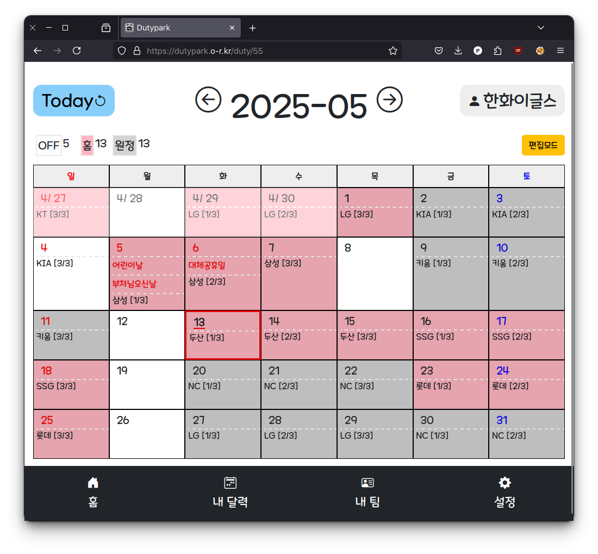

# Dutypark

[https://dutypark.o-r.kr](https://dutypark.o-r.kr)

<a href="#" target="_blank"></a> <a href="#" target="_blank"></a> <a href="#" target="_blank"></a> <a href="#" target="_blank"></a> <a href="#" target="_blank"></a> <a href="#" target="_blank"></a>

> **Add your duties and schedules in a snap — then share with friends or family.**

A lightweight, web-based duty and schedule manager. Perfect for both developers and non-tech users—track shifts,
personal events, tasks, D-Day countdowns, then share or collaborate in a snap.

---

## 🚀 Features

| Category                    | Feature                  | Description                                                 |
|:----------------------------|:-------------------------|:------------------------------------------------------------|
| **Duty Management**         | Duty Calendar            | Color-coded shifts & off-days                               |
|                             | Excel Schedule Import    | Bulk-upload duties via Excel                                |
| **Scheduling**              | Event Scheduling         | Create events with public/friends/family/private visibility |
|                             | D-Day Countdown          | "D-n" labels for special dates                              |
|                             | LLM based Title Parsing  | Auto-extract date/time from natural-language event titles   |
| **Sharing & Collaboration** | Friend & Family Sharing  | Share calendars with fine-grained permissions               |
|                             | Schedule Tagging         | Tag friends or family in events to notify and include them  |
|                             | Multi-Account Management | Switch or manage multiple user accounts seamlessly          |
| **Team & Organizations**    | Team Calendars           | Shared group schedules for teams or families                |
|                             | Team Manager Controls    | Admin tools: add/remove members, define custom duty types   |
| **Integrations**            | Holiday Sync             | Auto-fetch public holidays (via data.go.kr API)             |
|                             | OAuth Login              | Kakao login out-of-the-box (extendable to other providers)  |
| **UI & App**                | Mobile-Friendly & PWA    | Responsive design, installable Progressive Web App          |

---

## 🛠️ DEV

1. **Requirements**

    * JDK 21+
    * MySQL (or Docker)
    * Gradle 8+

2. **Database Setup (Docker)**

   ```bash
   cd dutypark_db
   docker compose up -d
   ```

   Update `src/main/resources/application-dev.yml` with your DB credentials.

3. **Configuration**

    * Disable SSL for local dev:

      ```yaml
      server.ssl.enabled: false
      server.port: 8080
      ```
    * (Optional) Add Slack webhook & holiday API keys in `application-*.yml`.

4. **Build & Run**

   ```bash
   ./gradlew build
   java -jar build/libs/dutypark-0.0.1-SNAPSHOT.jar \
     --spring.profiles.active=prod
   ```

---

## Sample Usage



Enjoy planning with **dutypark**.
