# 13. 모바일 웹 → iOS 앱 UI/UX 회귀 수정

- 기준일: 2026-08-15
- 목적: 반응형 모바일 웹(`http://localhost:5173`)을 iOS 네이티브 앱으로 이식하는 과정에서 나빠진 화면과 동작을 찾아 웹 수준으로 되돌린다.
- 기준 기기: iPhone 13 mini 시뮬레이터(`360×780pt`, iOS 26.5) / 모바일 웹 `375×812`
- 판정 원칙: 웹을 레퍼런스로 삼고, 명백히 나빠진 부분만 회귀로 판정한다.
- 관련 문서: [12. 웹 → iOS 기능·UX 동등성](../12-web-app-parity/README.md)

## 작업·보고 규칙

명확한 작업 단위마다 아래 순서를 완료한다.

1. 웹과 수정 전 iOS를 비교하고 회귀를 기록한다.
2. 수정 및 집중 테스트를 완료한다.
3. iPhone 13 mini에서 수정 후 화면과 핵심 상호작용을 확인한다.
4. 기능 커밋을 만든다.
5. 이 문서에 커밋 해시, 전·후 스크린샷, 변경 요약, 검증 결과를 즉시 반영하고 문서 커밋을 만든다.

스크린샷이나 상호작용 검증이 남은 기능 커밋은 `코드 커밋됨`으로만 기록하며 `완료`로 올리지 않는다.

## 검증 환경

| 항목 | 값 |
| --- | --- |
| 백엔드 | `http://localhost:8080` (dev, `dutypark_dev_db` MySQL) |
| 웹 | `http://localhost:5173`, viewport `375×812`, 한국어, 다크 모드 |
| 앱 | Debug UI fixture, 한국어, 다크 모드 |
| 시뮬레이터 | Outcrop iPhone 13 mini `F0737016-7654-4967-83FA-1DFB951DB36E` |
| 회귀 테스트 | 선택한 iOS 단위 테스트 전체 통과, `/tmp/dutypark-parity-main/Logs/Test/Test-Dutypark-2026.08.15_09-21-46-+0900.xcresult` |
| 시각 캡처 | `ParityVisualCaptureUITests` 1건 통과, `/tmp/Dutypark-ParityVisualCapture-20260815-11.xcresult` |

## 진행 현황

| # | 화면 | 회귀 내용 | 상태 | 관련 커밋 |
| --- | --- | --- | --- | --- |
| 1 | 대시보드 · 친구 | `친구관리`가 `친구`로 축약됨 | 완료 | `abee3186` |
| 2 | 대시보드 · 친구 | 웹에 없는 받은/보낸 요청 카운트 표시 | 완료 | `abee3186` |
| 3 | 대시보드 · 친구 | 작은 핸들 아이콘과 작동하지 않는 순서 변경 | 완료 | `abee3186` |
| 4 | Todo | 핸들 기반 순서 변경을 롱프레스 드래그로 변경 | 완료 | `a28f348c` |
| 5 | 대시보드 · 헤더 | 로고와 액션에 불필요한 캡슐 테두리 | 완료 | `74858618` |
| 6 | 하단 탭 | `달력`이 `캘린더`로 변경됨 | 완료 | `74858618` |
| 7 | 전역 현지화 | 한국어 앱에서 기본 패턴·메뉴·팀 월 이름 등이 영어로 표시됨 | 부분 완료 | `74858618`, `2cdc26ea`, `3987ea66` |
| 8 | 설정 · 기본 근무 패턴 | 근무 선택 목록과 요일 선택 UI가 웹보다 나빠짐 | 완료 | `b7bdc8ae` |
| 9 | 전역 확인 UI | destructive 확인 UI가 터치 위치와 무관한 시스템 시트로 표시됨 | 부분 완료 | `de46f754`, `92f3fa66`, `def118e2`, `b7bdc8ae`, `2316075a`, `84047661`, `bd3a1fc4`, `2ecdbb70`, `8a6a3aae` |
| 10 | 친구관리 상세 | UI 테스트에서 실 API를 호출해 화면 진입 종료 | 완료 | `f5da2cd1`, `24814f20` |

상태는 `대기 → 진행 중 → 수정됨·커밋 전 → 코드 커밋됨·시각 검증 전 → 완료` 순으로 관리한다.

## 커밋 보고

| 커밋 | 작업 단위 | 자동 검증 | 시각 증빙 | 판정 |
| --- | --- | --- | --- | --- |
| `de46f754` | 재사용 가능한 중앙 확인 패널 | 앱 빌드, 컴포넌트 테스트 | 기본 패턴 적용 화면으로 채택 결과 확보 | 완료 |
| `abee3186` | 대시보드 친구 섹션 웹 동등성 | `HomeDashboardTests` 11건 | 웹·수정 전·수정 후 확보 | 완료 |
| `a28f348c` | Todo 롱프레스 재정렬 | `TodoViewModelTests` 포함 전체 선택 테스트 | 웹·수정 후 확보, 빈 fixture라 실제 드래그는 단위 테스트로 검증 | 완료 |
| `f5da2cd1` | 친구관리 롱프레스 재정렬 | `SocialFeatureTests` 포함 전체 선택 테스트 | 후속 UI 검증에서 fixture 결함 발견 | `24814f20`으로 보완 |
| `92f3fa66` | 알림 삭제 중앙 확인 | `NotificationFeatureTests` 포함 전체 선택 테스트 | 삭제 가능한 알림 fixture 부재 | 코드 커밋됨·캡처 대기 |
| `def118e2` | 첨부 삭제 중앙 확인 | `AttachmentTests` 포함 전체 선택 테스트 | 첨부 fixture 부재 | 코드 커밋됨·캡처 대기 |
| `74858618` | 헤더 캡슐 제거, `달력` 복원, Root 메뉴 현지화 | AppTab·RootChrome·컴포넌트 테스트 및 UI 캡처 | 대시보드·메뉴 수정 후 확보 | 완료 |
| `2cdc26ea` | 앱 언어 override 및 로그인·OAuth·API 오류 현지화 | 앱 언어 override·Auth 테스트 포함 전체 선택 테스트 | 한국어 메뉴·설정 화면에서 Foundation 조회 결과 확인 | 완료 |
| `3987ea66` | 팀 연월 선택기의 월 이름 현지화 | `TeamFeatureTests` 앱 ko·기기 en 조합 | 웹 기준 확보, iOS 연월 선택기 캡처 대기 | 코드 커밋됨·캡처 대기 |
| `b7bdc8ae` | 기본 근무 패턴 UI 및 캘린더 중앙 확인 흐름 | Settings·Calendar 테스트 및 UI 캡처 | 패턴 편집·해제 확인 확보, 월 일괄 변경 캡처 대기 | 패턴 완료·캘린더 캡처 대기 |
| `24814f20` | 친구관리 UI fixture 안정화 및 실제 롱프레스 재정렬 | iPhone 13 mini 전용 UI 테스트 1건 | 친구관리 수정 후 화면 확보 | 완료 |
| `2316075a` | 관리자 팀 삭제·회원 세션 종료 중앙 확인 | AdminTeam·AdminFeature 테스트 포함 전체 선택 테스트 | 관리자 fixture 부재 | 코드 커밋됨·캡처 대기 |
| `84047661` | 설정의 계정·프로필 destructive 확인 5종 | iPhone 13 mini `SettingsFeatureTests` 29건 | 설정 화면 확보, 확인 패널 직접 캡처 대기 | 코드 커밋됨·패널 캡처 대기 |
| `bd3a1fc4` | Todo 작성 취소·삭제·태그 해제 중앙 확인 | iPhone 13 mini 단위 32건·UI 1건 | Todo 화면 확보, 확인 패널 직접 캡처 대기 | 코드·상호작용 완료·캡처 대기 |
| `2ecdbb70` | 팀 일정 삭제 및 팀 관리 확인 UI | iPhone 13 mini `TeamFeatureTests` 24건 | 팀 미가입 화면만 확보 | 코드·테스트 완료·가입 fixture 캡처 대기 |
| `8a6a3aae` | Root 햄버거 로그아웃 중앙 확인 | iPhone 13 mini 전용 테스트 3건 | 메뉴 화면 확보, 패널 직접 캡처 대기 | 코드·테스트 완료·캡처 대기 |

## 상세 변경 보고

### 대시보드 친구 섹션 — `abee3186`

| 웹 기준 | iOS 수정 전 | iOS 수정 후 |
| --- | --- | --- |
| 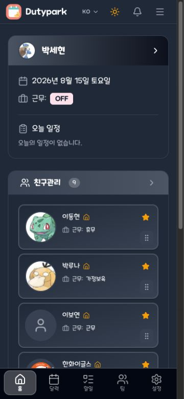 | 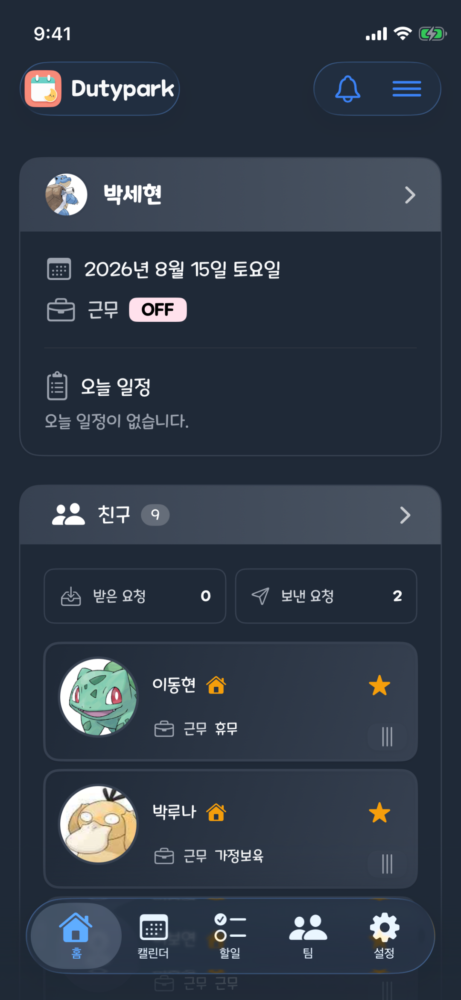 | 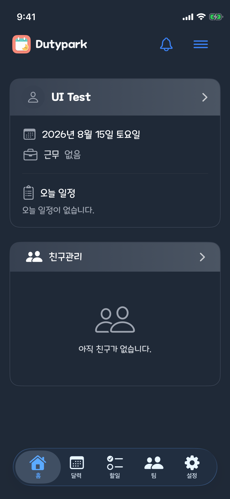 |

- 원래 웹: 제목은 `친구관리`, 요청 카운트와 별도 재정렬 핸들이 없다.
- 수정 전 iOS: 제목이 `친구`로 축약됐고 받은/보낸 요청 카운트 및 작은 핸들을 노출했다.
- 수정 후 iOS: 제목을 복원하고 카운트와 핸들을 제거했다. 친구 카드 자체를 0.35초 이상 누르면 드래그 모드가 된다.
- 접근성: VoiceOver 위/아래 이동 액션은 유지했다.
- 검증: `HomeDashboardTests` 11건 통과, iPhone 13 mini 수정 후 화면 확인.

### Todo 롱프레스 재정렬 — `a28f348c`

| 웹 기준 | iOS 수정 후 |
| --- | --- |
| 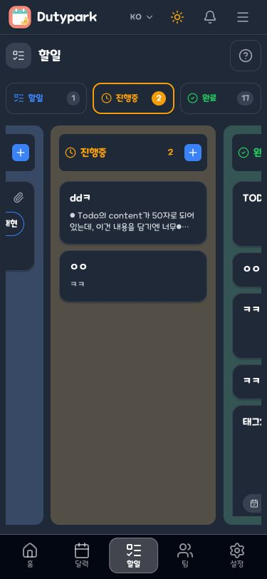 | 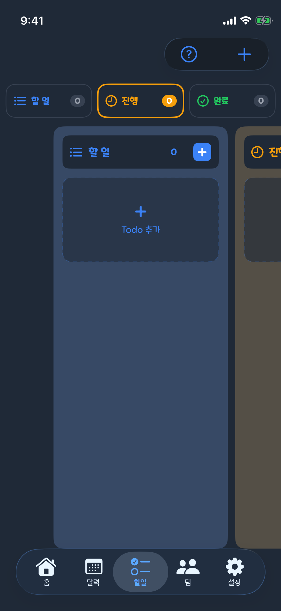 |

- 별도 재정렬 아이콘을 제거하고 카드 자체를 0.35초 롱프레스한 뒤 드래그하도록 통일했다.
- 일반 스크롤과 충돌하지 않도록 롱프레스 중 이동 허용 범위를 제한했다.
- 빈 UI fixture에서는 핸들 제거와 레이아웃을 확인했고, 순서 저장 정책은 집중 테스트로 검증했다.

### 친구관리 상세 롱프레스 재정렬 — `f5da2cd1`, `24814f20`

| 웹 기준 | iOS 수정 후 |
| --- | --- |
| 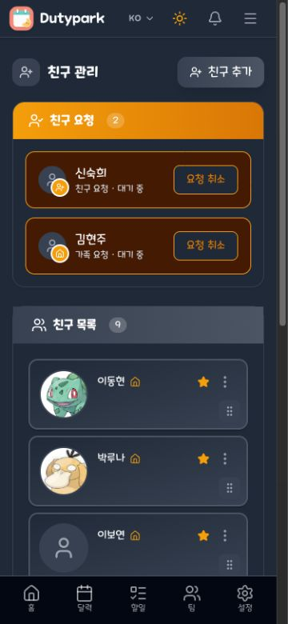 | 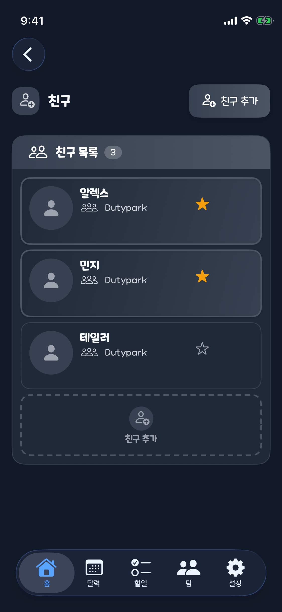 |

- 최초 크래시처럼 보인 현상은 인증 UI 테스트 fixture가 친구 API를 실호출해 `APIClient`의 보호용 `fatalError`에 도달한 것이 원인이었다.
- 친구 3명 fixture와 네트워크 없는 로컬 순서 저장 경로를 추가하고 제네릭 재정렬 래퍼를 단순화했다.
- iPhone 13 mini에서 햄버거 → 친구관리 진입 → 첫 카드를 0.5초 롱프레스 → 두 번째 카드로 드래그 → 실제 y 순서 역전까지 검증했다.
- 결과: 1개 UI 테스트, 실패 0건, `/tmp/Dutypark-SocialParity-20260815-01.xcresult`.

### 헤더·탭·한국어 메뉴 — `74858618`

| 웹 메뉴 | iOS 수정 후 대시보드 | iOS 수정 후 메뉴 |
| --- | --- | --- |
| 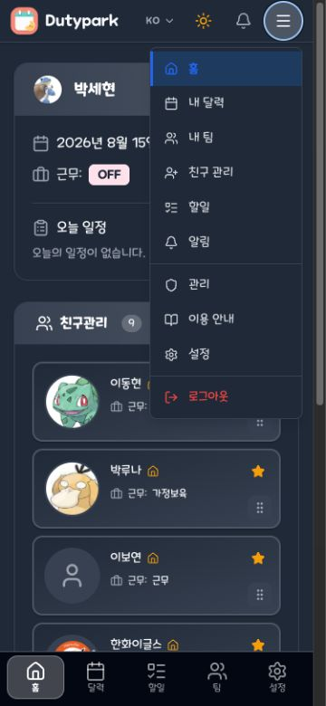 |  | 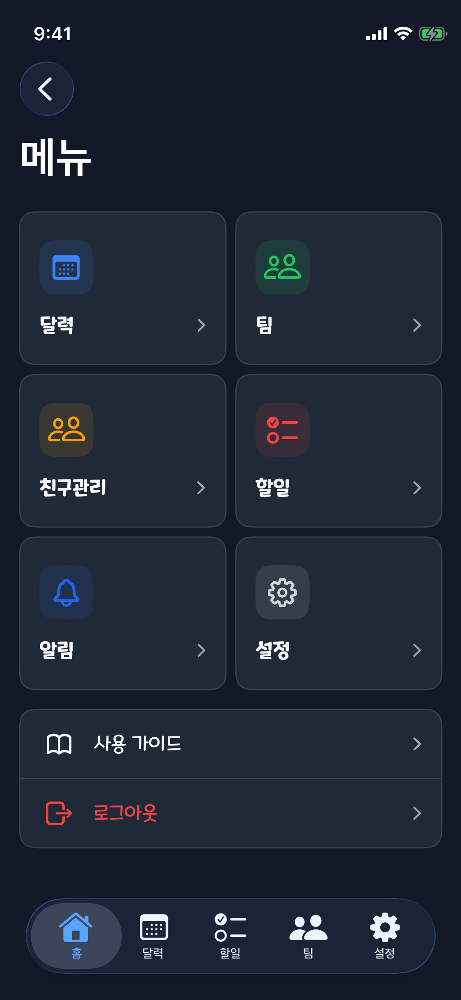 |

- iOS 26 toolbar가 자동 적용하던 로고·액션 캡슐 배경을 숨겼다.
- 하단 탭을 `캘린더`에서 `달력`으로 되돌렸다.
- 앱 언어를 한국어로 강제하고 기기 언어를 영어로 두어도 메뉴가 `달력·팀·친구관리·할일·알림·설정`으로 표시되는 것을 확인했다.
- 관련 구현은 단위 테스트와 iPhone 13 mini 시각 캡처를 통과했다.

### 기본 근무 패턴 목록 UI — `b7bdc8ae`

| 웹 패턴 편집 | 웹 근무 선택 | iOS 수정 후 |
| --- | --- | --- |
| 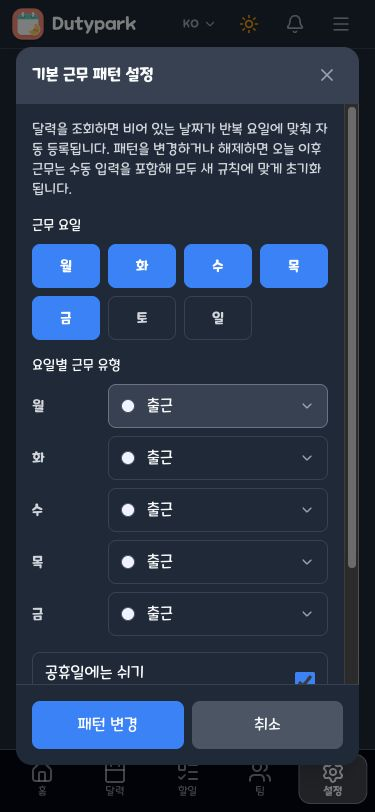 | 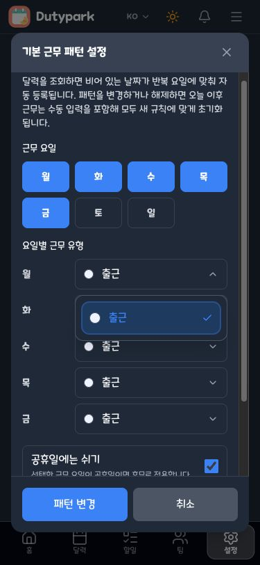 | 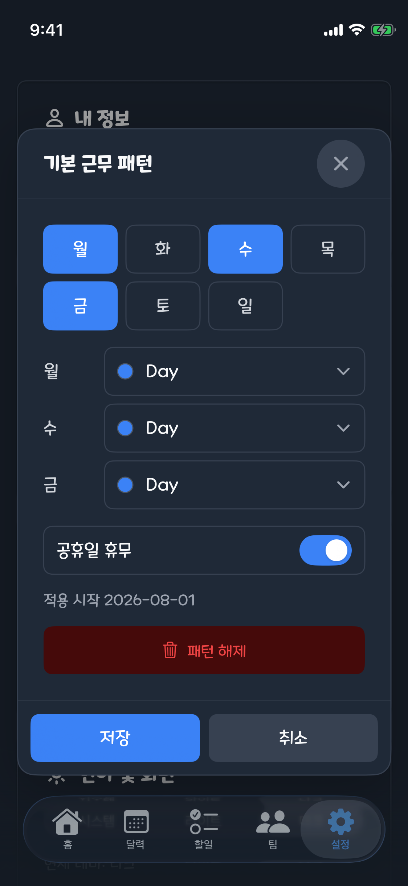 |

- 웹처럼 7개 요일 칩을 먼저 표시하고 선택한 요일의 근무 행만 노출한다.
- 근무 행에 색상, 이름, 선택 상태와 펼침 표시를 함께 보여준다.
- 신규 패턴은 웹과 동일하게 월~금 및 첫 근무유형을 기본값으로 사용한다.
- `적용 시작`, `패턴 해제` 등 앱 언어를 따르지 않던 문자열을 함께 교정했다.
- 패턴 저장·해제는 공통 중앙 확인 패널을 사용하며 iPhone 13 mini UI 캡처를 통과했다.

### 앱 언어 override — `2cdc26ea`

| 한국어 메뉴 | 한국어 설정 |
| --- | --- |
|  | 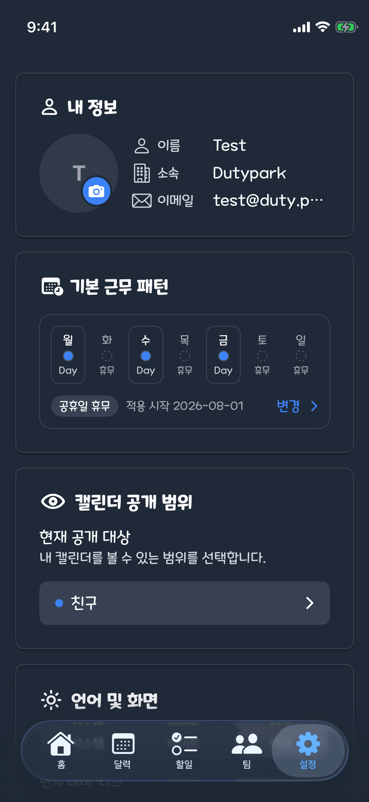 |

- SwiftUI의 `locale` 환경값과 별개로 기기 언어를 따라가던 Foundation 문자열 조회를 앱에서 선택한 `.lproj` bundle로 통일했다.
- 캘린더·설정 공통 문구, API 오류, 로그인 남은 횟수, OAuth 오류가 앱 언어를 따른다.
- 알 수 없는 시스템 인증 오류의 영문 `localizedDescription`을 그대로 노출하지 않고 앱 언어의 일반 오류로 대체한다.
- 앱 언어 한국어·기기 언어 영어 조합의 회귀 테스트를 통과했다.

### 팀 월 이름 현지화 — `3987ea66`

| 웹 기준 | iOS 수정 후 |
| --- | --- |
| 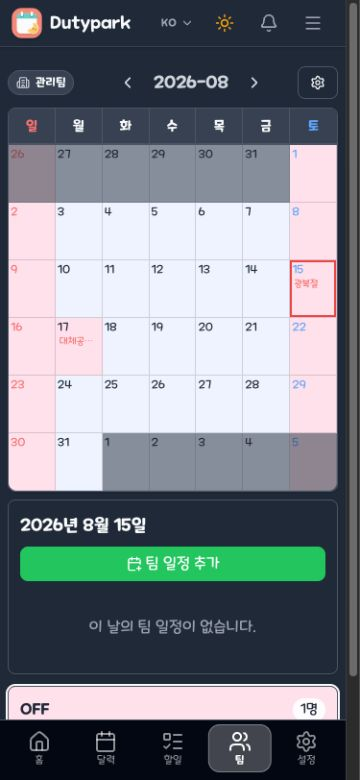 | 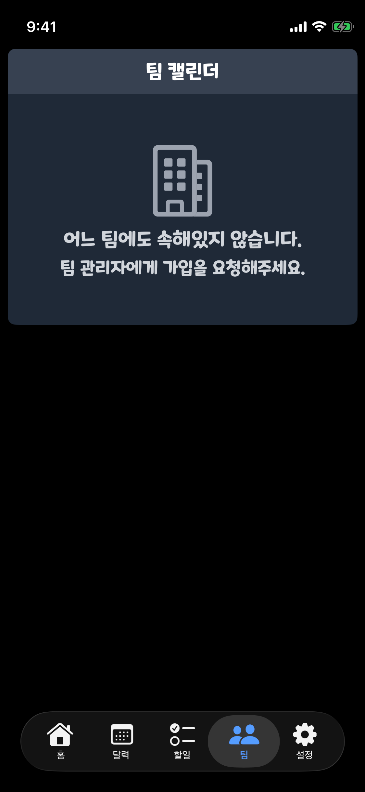 |

- 기기 캘린더의 `monthSymbols`를 직접 사용하던 코드를 앱 locale 기반 `DateFormatter`로 교체했다.
- 앱 한국어·기기 영어에서는 `8월`, 앱 영어에서는 `August`가 되는 회귀 테스트를 통과했다.
- 팀 연월 선택기를 여는 UI fixture를 추가해 수정 후 스크린샷을 보강한다.

### 달력·팀 비교 기준 확장 — `58cbf120`

| 화면 | 모바일 웹 | iOS |
| --- | --- | --- |
| 달력 | 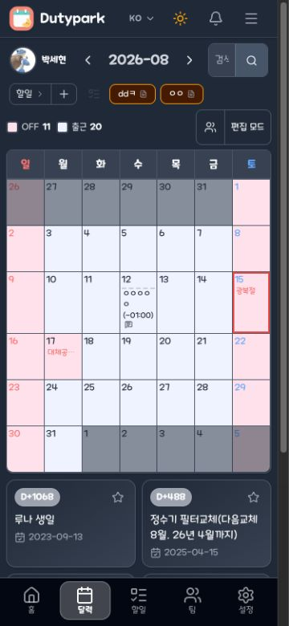 | 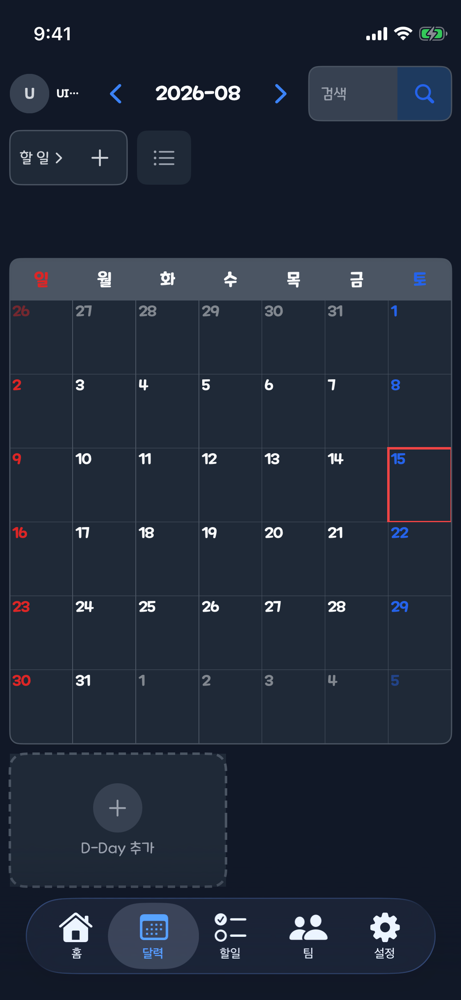 |
| 팀 |  |  |

- 달력은 웹과 iOS fixture의 일정·D-Day 데이터가 달라 데이터 개수는 판정에서 제외하고 월 그리드와 네비게이션 기준으로 보존한다.
- 팀은 웹이 가입 팀, iOS가 미가입 fixture라 현재 직접 비교할 수 없다. 같은 팀 fixture를 제공한 뒤 연월 선택기와 팀 일정 UI를 판정한다.
- 확장 캡처는 홈·Todo·달력·팀·메뉴·설정·패턴 편집·패턴 해제 확인 8개 화면을 한 흐름에서 검증한다.

### 중앙 확인 UI — `de46f754`, `b7bdc8ae` 및 후속 적용 커밋

| 웹 기준 | iOS 수정 후 |
| --- | --- |
| 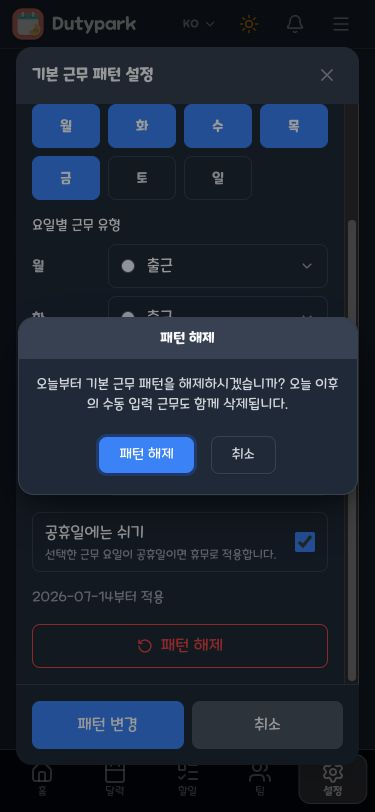 | 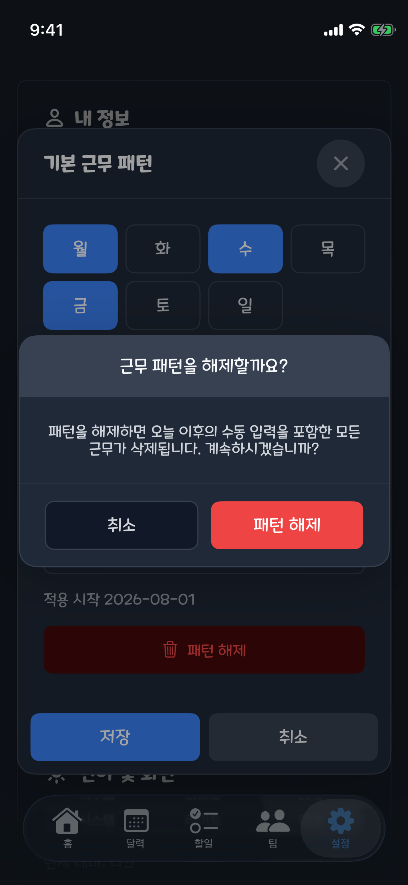 |

- 터치 지점이나 OS에 따라 위치가 달라지는 `confirmationDialog` 대신 화면 중앙의 공통 확인 패널을 추가했다.
- 제목, 영향 범위 설명, 취소 및 destructive 동작을 한 패널에서 명확히 보여준다.
- 기본 패턴 해제는 iPhone 13 mini UI 테스트에서 중앙 표시와 한국어 문구를 확인했다.
- 알림 삭제(`92f3fa66`)와 첨부 삭제(`def118e2`)에도 같은 패널을 적용했다. 두 화면은 삭제 대상 fixture를 추가한 뒤 별도 캡처한다.
- 관리자 팀 삭제와 회원 세션 종료(`2316075a`)도 중앙 패널로 통일했다. 진행 중에는 취소·외부 닫기·중복 제출을 막고, 세션 종료 패널에는 회원·기기·브라우저·IP 범위를 표시한다.

### 설정 계정·프로필 확인 — `84047661`

| 웹 설정 기준 | iOS 설정 |
| --- | --- |
| 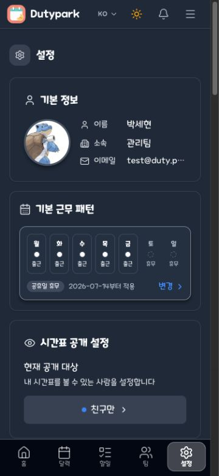 |  |

- 프로필 사진 삭제, 로그아웃, 관리자 해제, 관리 계정 전환, 세션 종료를 공통 중앙 패널로 통일했다.
- 세션 종료는 웹처럼 기기·브라우저·IP를 영향 범위에 포함한다.
- 작업 중에는 중복 실행과 배경·gesture dismiss를 차단한다.
- iPhone 13 mini에서 `SettingsFeatureTests` 29건이 통과했다. 직접 확인 패널 캡처는 전용 fixture 보강 후 추가한다.

### Todo destructive 확인 — `bd3a1fc4`

| 웹 Todo | iOS Todo |
| --- | --- |
|  |  |

- 작성·수정 변경사항 폐기, Todo 삭제, 내 태그 해제를 중앙 확인 패널로 통일했다.
- 삭제 시 첨부파일도 함께 삭제되고, 태그 해제 시 보드에서 제거된다는 영향 안내는 유지했다.
- iPhone 13 mini에서 `TodoViewModelTests` 32건과 작성 취소 중앙 패널 UI 테스트 1건이 통과했다.
- 결과: `/tmp/dutypark-todo-confirmation-unit-suite.xcresult`, `/tmp/dutypark-todo-confirmation-ui.xcresult`.

### 팀 일정·관리 확인 — `2ecdbb70`

| 웹 팀 기준 | iOS 팀 fixture |
| --- | --- |
|  |  |

- 팀 일정 삭제에 일정 제목과 복구 불가 영향을 표시하고 중앙 패널로 통일했다.
- 멤버 제외, 권한 변경, 관리자 위임·초기화, 멤버 추가, 근무유형·업로드 변경사항 폐기도 같은 패턴을 사용한다.
- iPhone 13 mini에서 `TeamFeatureTests` 24건이 모두 통과했다.
- 가입 팀 데이터가 있는 fixture를 준비한 뒤 실제 팀 일정 삭제·관리 패널을 캡처한다.

### Root 로그아웃 확인 — `8a6a3aae`

- 햄버거 메뉴의 로그아웃 native `confirmationDialog`를 중앙 패널로 교체했다.
- 로그아웃 처리 중에는 재실행, 취소, 배경 탭, gesture dismiss를 차단한다.
- 링크 미지원 같은 정보 alert는 기존 방식으로 유지했다.
- iPhone 13 mini에서 전용 정책·소스 테스트 3건이 통과했다: `/tmp/dutypark-root-logout-20260815.xcresult`.

## 시각 회귀 자동화

`ParityVisualCaptureUITests`는 한국어·다크모드로 앱을 실행해 다음 화면을 순서대로 캡처한다.

- 대시보드
- Todo
- 달력
- 팀
- 햄버거 메뉴
- 설정
- 기본 근무 패턴
- 패턴 해제 중앙 확인

2026-08-15 실행 결과: 1개 테스트, 실패 0건, 약 36.6초.

## 미해결·다음 순서

- [x] 친구관리 상세 진입과 롱프레스 재정렬 시각·상호작용 검증
- [x] 헤더·탭·Root 메뉴 현지화 기능 커밋 및 시각 보고
- [x] 기본 근무 패턴 UI와 패턴 해제 중앙 확인 기능 커밋 및 시각 보고
- [ ] 캘린더 월 일괄 변경 중앙 선택 화면 스크린샷 추가
- [ ] 알림 삭제용 UI fixture와 중앙 패널 스크린샷 추가
- [ ] 첨부 삭제용 UI fixture와 중앙 패널 스크린샷 추가
- [ ] 관리자 팀 삭제·회원 세션 종료 UI fixture와 중앙 패널 스크린샷 추가
- [ ] 설정 로그아웃·프로필 삭제 중앙 패널 스크린샷 추가
- [ ] Todo 작성 취소·삭제 중앙 패널 스크린샷 추가
- [ ] 팀 연월 선택기 한국어 스크린샷 추가
- [ ] 가입 팀 fixture로 일정 삭제·관리 중앙 패널 스크린샷 추가
- [ ] Root 햄버거 로그아웃 중앙 패널 스크린샷 추가
- [ ] 설정의 사진 삭제·관리자 해제·관리 계정 전환 확인 UI 조사 및 수정
- [ ] 로그아웃 등 남은 전역 `confirmationDialog` 조사 및 수정
