# 13. 모바일 웹 → iOS 앱 UI/UX 회귀 수정

- 기준일: 2026-08-15
- 목적: 반응형 모바일 웹(`http://localhost:5173`)을 iOS 네이티브 앱으로 이식하는 과정에서 나빠진 화면과 동작을 찾아 웹 수준으로 되돌린다.
- 기준 기기: iPhone 13 mini 시뮬레이터(`375×812pt`, iOS 26.5) / 모바일 웹 `375×812`
- 판정 원칙: 웹을 레퍼런스로 삼고, 명백히 나빠진 부분만 회귀로 판정한다.
- 관련 문서: [12. 웹 → iOS 기능·UX 동등성](../12-web-app-parity/README.md)

## 작업·보고 규칙

명확한 작업 단위마다 아래 순서를 완료한다.

1. 웹과 수정 전 iOS를 비교하고 회귀를 기록한다.
2. 수정 및 집중 테스트를 완료한다.
3. iPhone 13 mini에서 수정 후 화면과 핵심 상호작용을 확인한다.
4. 기능 커밋을 만든다.
5. 이 문서에 커밋 해시, 전·후 스크린샷, 변경 요약, 검증 결과를 즉시 반영하고 문서 커밋을 만든다.

스크린샷이나 상호작용 검증이 남은 기능 커밋은 `코드 커밋됨`으로만 기록하며 `완료`로 올리지 않는다.

## 검증 환경

| 항목 | 값 |
| --- | --- |
| 백엔드 | `http://localhost:8080` (dev, `dutypark_dev_db` MySQL) |
| 웹 | `http://localhost:5173`, viewport `375×812`, 한국어, 다크 모드 |
| 앱 | Debug UI fixture, 한국어, 다크 모드 |
| 시뮬레이터 | Outcrop iPhone 13 mini `F0737016-7654-4967-83FA-1DFB951DB36E` |
| 회귀 테스트 | 선택한 iOS 단위 테스트 전체 통과, `/tmp/dutypark-parity-main/Logs/Test/Test-Dutypark-2026.08.15_09-21-46-+0900.xcresult` |
| 시각 캡처 | `ParityVisualCaptureUITests` 1건 통과, `/tmp/Dutypark-ParityVisualCapture-20260815-11.xcresult` |

## 진행 현황

| # | 화면 | 회귀 내용 | 상태 | 관련 커밋 |
| --- | --- | --- | --- | --- |
| 1 | 대시보드 · 친구 | `친구관리`가 `친구`로 축약됨 | 완료 | `abee3186` |
| 2 | 대시보드 · 친구 | 웹에 없는 받은/보낸 요청 카운트 표시 | 완료 | `abee3186` |
| 3 | 대시보드 · 친구 | 작은 핸들 아이콘과 작동하지 않는 순서 변경 | 완료 | `abee3186` |
| 4 | Todo | 핸들 기반 순서 변경을 롱프레스 드래그로 변경 | 완료 | `a28f348c` |
| 5 | 대시보드 · 헤더 | 로고와 액션에 불필요한 캡슐 테두리 | 완료 | `74858618` |
| 6 | 하단 탭 | `달력`이 `캘린더`로 변경됨 | 완료 | `74858618` |
| 7 | 전역 현지화 | 한국어 앱에서 기본 패턴·메뉴·팀 월 이름 등이 영어로 표시됨 | 부분 완료 | `74858618`, `2cdc26ea`, `3987ea66` |
| 8 | 설정 · 기본 근무 패턴 | 근무 선택 목록과 요일 선택 UI가 웹보다 나빠짐 | 완료 | `b7bdc8ae` |
| 9 | 전역 확인 UI | destructive 확인 UI가 터치 위치와 무관한 시스템 시트로 표시됨 | 완료 | `de46f754`, `92f3fa66`, `def118e2`, `b7bdc8ae`, `2316075a`, `84047661`, `bd3a1fc4`, `2ecdbb70`, `8a6a3aae`, `a19f4047`, `cc673095`, `38dc5bca`, `aaca282c` |
| 10 | 친구관리 상세 | UI 테스트에서 실 API를 호출해 화면 진입 종료 | 완료 | `f5da2cd1`, `24814f20` |
| 11 | 친구관리 상세 | 존재하지 않는 SF Symbol로 `더보기` 버튼이 0×0이고 터치 불가 | 완료 | `38dc5bca` |
| 12 | 달력 · 월 일괄 변경 | 한국어 연도가 `2,026년`으로 숫자 그룹화됨 | 완료 | `c47a77ea` |
| 13 | 설정 | 같은 기능의 섹션 이름·설명이 모바일 웹과 다르게 표시됨 | 완료 | `4d8b9de3` |
| 14 | 햄버거 메뉴 | 웹의 `이용 안내`가 iOS에서 `사용 가이드`로 변경됨 | 완료 | `f9291784` |
| 15 | 달력 | 근무 요약·액션이 없는데도 빈 도구행이 남아 월 그리드 위에 큰 공백이 생김 | 완료 | `a0aea3a8` |
| 16 | Todo | 선택한 상태와 다른 열이 보여 카드가 화면 밖에 놓이고, 롱프레스 제스처가 일반 탭을 막음 | 완료 | `b84b2478` |
| 17 | Todo | 웹의 `진행중` 상태가 iOS에서 `진행`으로 축약됨 | 완료 | `73fe7e0a` |
| 18 | 대시보드 · 친구 | 수정 후 증빙이 빈 fixture라 친구 총수·목록 유지 여부를 비교할 수 없음 | 완료 | `ed29121c` |
| 19 | 설정 · 회원 탈퇴 | 영구 삭제 버튼이 `내 계정 삭제`로 축약되어 비가역성이 약하게 안내됨 | 완료 | `12974a63` |
| 20 | 달력 · 일정 검색 | 상세도 검색하지만 placeholder가 `제목으로 검색`이라고 잘못 안내함 | 완료 | `83ea522e` |
| 21 | 팀 관리 | 대표 취소 확인에서 대상 대표 이름이 빠져 권한 초기화 대상을 알 수 없음 | 완료 | `76e0f25f` |
| 22 | 팀 달력 | 한국어 앱의 요일이 기기 언어를 따라 영어로 표시될 수 있음 | 완료 | `3f9fe25a` |
| 23 | 알림 드롭다운 | 목록을 확인하고 닫아도 iOS만 미읽음 배지와 강조가 계속 남음 | 완료 | `a72a15ca` |
| 24 | 설정 · 소셜 연결 | Apple 해제 안내가 실제 권한 철회 동작과 반대로 표시됨 | 완료 | `54bc2c42` |
| 25 | 팀 상세 | 일정이 있는데도 빈 근무 영역에 `이 날의 팀 일정이 없습니다.`가 중복 표시됨 | 완료 | `9b37abb7` |
| 26 | 게스트 · 이용 안내 | 네이티브 제목만 `이용 안내 및 릴리스 노트`로 길어 웹 본문 제목과 다름 | 완료 | `e60632a0` |
| 27 | 게스트 · 공개 달력 | 웹과 달리 연월 직접 선택이 없어 먼 달까지 한 달씩 반복 이동해야 함 | 완료 | `41e1c184` |
| 28 | 팀 근무 현황 | 근무 인원 배지가 단위 없이 `3`처럼 표시되어 의미가 불분명함 | 완료 | `1153345a` |
| 29 | 관리자 · 회원 목록 | 활성 세션 수가 `1개`·`0개`로만 표시되어 숫자의 의미와 빈 상태를 알기 어려움 | 완료 | `e34d67c4` |
| 30 | 설정 · 기본 근무 패턴 | 숨김 근무유형이 남으면 저장이 막히지만 이유와 해결 방법이 표시되지 않음 | 완료 | `4ba4ab07` |
| 31 | 게스트 · 이용 안내 | `홈으로 돌아가기`가 네이티브 게스트 화면 대신 WebView 안의 웹 홈을 열음 | 완료 | `6b69ce5a` |
| 32 | 알림 드롭다운 | 작성자 프로필 사진이 있어도 항상 동일한 기본 사람 아이콘으로 표시됨 | 완료 | `0d16412b` |

상태는 `대기 → 진행 중 → 수정됨·커밋 전 → 코드 커밋됨·시각 검증 전 → 완료` 순으로 관리한다.

## 커밋 보고

| 커밋 | 작업 단위 | 자동 검증 | 시각 증빙 | 판정 |
| --- | --- | --- | --- | --- |
| `de46f754` | 재사용 가능한 중앙 확인 패널 | 앱 빌드, 컴포넌트 테스트 | 기본 패턴 적용 화면으로 채택 결과 확보 | 완료 |
| `abee3186` | 대시보드 친구 섹션 웹 동등성 | `HomeDashboardTests` 11건 | 웹·수정 전·수정 후 확보 | 완료 |
| `a28f348c` | Todo 롱프레스 재정렬 | `TodoViewModelTests` 포함 전체 선택 테스트 | 웹·수정 후 확보, `b84b2478`에서 실제 카드 롱프레스 재정렬까지 UI 검증 | 완료 |
| `f5da2cd1` | 친구관리 롱프레스 재정렬 | `SocialFeatureTests` 포함 전체 선택 테스트 | 후속 UI 검증에서 fixture 결함 발견 | `24814f20`으로 보완 |
| `92f3fa66` | 알림 삭제 중앙 확인 | `NotificationFeatureTests` 포함 전체 선택 테스트 | `da97937c`에서 개별·일괄 삭제 캡처 확보 | 완료 |
| `def118e2` | 첨부 삭제 중앙 확인 | `AttachmentTests` 포함 전체 선택 테스트 | `28bfcbed`에서 실제 메뉴 경로 캡처 확보 | 완료 |
| `74858618` | 헤더 캡슐 제거, `달력` 복원, Root 메뉴 현지화 | AppTab·RootChrome·컴포넌트 테스트 및 UI 캡처 | 대시보드·메뉴 수정 후 확보 | 완료 |
| `2cdc26ea` | 앱 언어 override 및 로그인·OAuth·API 오류 현지화 | 앱 언어 override·Auth 테스트 포함 전체 선택 테스트 | 한국어 메뉴·설정 화면에서 Foundation 조회 결과 확인 | 완료 |
| `3987ea66` | 팀 연월 선택기의 월 이름 현지화 | `TeamFeatureTests` 앱 ko·기기 en 조합 | `d444f095`에서 1~12월 한국어 캡처 확보 | 완료 |
| `b7bdc8ae` | 기본 근무 패턴 UI 및 캘린더 중앙 확인 흐름 | Settings·Calendar 테스트 및 UI 캡처 | 패턴 편집·해제 확인 확보, `f390c6bc`에서 월 일괄 변경 캡처 확보 | 완료 |
| `24814f20` | 친구관리 UI fixture 안정화 및 실제 롱프레스 재정렬 | iPhone 13 mini 전용 UI 테스트 1건 | 친구관리 수정 후 화면 확보 | 완료 |
| `2316075a` | 관리자 팀 삭제·회원 세션 종료 중앙 확인 | AdminTeam·AdminFeature 테스트 포함 전체 선택 테스트 | `eee695a9`에서 두 패널 캡처 확보 | 완료 |
| `84047661` | 설정의 계정·프로필 destructive 확인 5종 | iPhone 13 mini `SettingsFeatureTests` 29건 | `22d0bc18`에서 프로필 삭제·설정 로그아웃 패널 직접 캡처 확보 | 완료 |
| `bd3a1fc4` | Todo 작성 취소·삭제·태그 해제 중앙 확인 | iPhone 13 mini 단위 32건·UI 1건 | `b84b2478`에서 실제 카드 경로로 작성 취소·삭제 패널 재검증 | 완료 |
| `2ecdbb70` | 팀 일정 삭제 및 팀 관리 확인 UI | iPhone 13 mini `TeamFeatureTests` 24건 | `d444f095`에서 가입 팀 패널 2종 확보 | 완료 |
| `8a6a3aae` | Root 햄버거 로그아웃 중앙 확인 | iPhone 13 mini 전용 테스트 3건 | `22d0bc18`에서 메뉴 로그아웃 패널 직접 캡처 확보 | 완료 |
| `a19f4047` | 소셜 계정 연결 해제 중앙 확인 | iPhone 13 mini 전용 테스트 3건 | `8c947a62`에서 관리·확인 패널 캡처 확보 | 완료 |
| `cc673095` | SSO 추가정보 draft 폐기 중앙 확인 | iPhone 13 mini OAuth 가입 테스트 6건 | `eb822f5e`에서 직접 진입 캡처 확보 | 완료 |
| `38dc5bca` | 친구 destructive 확인 4종 및 `더보기` 터치 복원 | Social 19건·재정렬 UI·삭제 패널 UI | 친구 삭제 중앙 패널 확보 | 완료 |
| `c47a77ea` | 달력 연도 치환의 천 단위 구분 제거 | 앱·테스트 빌드, exact 한국어 문자열 회귀 테스트 | 수정 후 월 일괄 변경 화면 재캡처 | 완료 |
| `f390c6bc` | 달력 월 일괄 변경 시각 fixture | iPhone 13 mini UI 1건 | 중앙 선택 패널·`2026년` 표기 확보 | 완료 |
| `22d0bc18` | 설정·Root 확인 패널 시각 fixture | iPhone 13 mini UI 3건 및 안정화 재캡처 1건 | 프로필 삭제·설정 로그아웃·메뉴 로그아웃 확보 | 완료 |
| `da97937c` | 알림 삭제 확인 시각 fixture와 전환 안정성 검증 | iPhone 13 mini UI 2건 | 개별·읽은 알림 일괄 삭제 패널 확보 | 완료 |
| `3bef215b` | DEBUG 전용 direct visual fixture 라우트 | Debug·Release 빌드 및 route 정책 테스트 | 첨부·SSO·관리자 캡처 경로 제공 | 완료 |
| `28bfcbed` | 첨부 삭제 확인 시각 검증 | iPhone 13 mini UI 1건 | 메뉴→삭제 중앙 패널 확보 | 완료 |
| `d444f095` | 가입 팀 달력·관리 시각 fixture | iPhone 13 mini UI 3건 | 연월 선택·일정 삭제·구성원 제외 확보 | 완료 |
| `aaca282c` | 긴 확인 문구의 취소·확인 버튼 겹침 방지 | 공통 패널 계약·generic test build | 관리자 세션 종료에서 픽셀 재검증 | 완료 |
| `eee695a9` | 관리자 destructive 확인 시각 fixture | iPhone 13 mini UI 2건 | 팀 삭제·회원 세션 종료 확보 | 완료 |
| `8c947a62` | 소셜 연결 관리 시각 fixture | iPhone 13 mini UI 1건 | Kakao 관리·연결 해제 패널 확보 | 완료 |
| `eb822f5e` | SSO 추가정보 draft 폐기 시각 검증 | iPhone 13 mini UI 1건 | 작성 내용 폐기 중앙 패널 확보 | 완료 |
| `4d8b9de3` | 설정 첫 화면 카피의 모바일 웹 동등성 | exact ko/en 회귀 테스트, generic build·test build | iPhone 13 mini 설정 첫 화면 재캡처 | 완료 |
| `f9291784` | Root 메뉴의 가이드 문구 동등성 | Root 현지화 3건·UI 1건, generic test build | 햄버거 메뉴 `이용 안내` 캡처 | 완료 |
| `a0aea3a8` | 내용 없는 달력 근무 도구행 제거 | Calendar focused test, generic test build | iPhone 13 mini 월 그리드 상단 재캡처 | 완료 |
| `b84b2478` | Todo 카드 탭·롱프레스·선택 열 정렬 복원 | Todo 단위 32건, iPhone 13 mini UI 5건 | 실제 카드 탭 삭제·작성 취소 패널 및 드래그·스크롤 검증 | 완료 |
| `73fe7e0a` | Todo `진행중` 상태 문구 복원 | exact ko/en 테스트, generic build·test build, UI 1건 | 상단 탭·보드 열 `진행중` 재캡처 | 완료 |
| `ed29121c` | 친구가 있는 Home parity fixture | HomeDashboard 11건, generic build·test build, UI 1건 | 친구 총수 3·고정 2·일반 1 재캡처 | 완료 |
| `12974a63` | 회원 탈퇴 최종 버튼의 영구 삭제 경고 복원 | AccountDeletion 9건, generic build·test build, UI 1건 | 5/5 최종 확인 화면 재캡처 | 완료 |
| `83ea522e` | 일정 검색 placeholder의 검색 범위 복원 | exact ko/en 테스트, generic build·test build, UI 1건 | 검색 모달 placeholder 재캡처 | 완료 |
| `76e0f25f` | 팀 대표 취소 확인에 대상명 표시 | 포맷·fallback 2건, generic build·test build, UI 1건 | 김듀티 대상 중앙 패널 재캡처 | 완료 |
| `3f9fe25a` | 팀 달력 요일을 앱 언어에 고정 | exact ko/en 테스트, generic test build, UI 1건 | 영어 기기·한국어 앱 조합 재캡처 | 완료 |
| `a72a15ca` | 알림 드롭다운 닫기 시 확인한 알림 읽음 처리 | 정책·중복 요청 focused 테스트, generic build·test build, UI 1건 | 닫은 뒤 미읽음 배지 제거 재캡처 | 완료 |
| `54bc2c42` | Apple 연결 해제의 권한 철회 정책 안내 | exact ko/en 테스트, generic build·test build, UI 1건 | Apple 관리·확인 패널 재캡처 | 완료 |
| `9b37abb7` | 빈 팀 근무 영역의 일정 없음 오안내 제거 | TeamFeatureTests 27건, generic build·test build, UI 1건 | 일정 카드 유지·거짓 빈 문구 부재 재캡처 | 완료 |
| `e60632a0` | 게스트 이용 안내 제목을 웹과 통일 | exact ko/en 테스트, generic build, UI 1건 | 네이티브·웹 본문 제목 일치 재캡처 | 완료 |
| `41e1c184` | 게스트 공개 달력 연월 직접 선택 | focused unit 3건, generic build·test build, UI 1건 | 연월 선택기·2028년 2월 이동 재캡처 | 완료 |
| `1153345a` | 팀 근무 인원 배지의 현지화 단위 복원 | exact ko/en 테스트, generic test build, UI 1건 | 2명 배지와 팀원 카드 재캡처 | 완료 |
| `e34d67c4` | 관리자 회원 목록의 활성 세션 상태 명확화 | exact ko/en 테스트, generic test build, UI 1건 | 활성 세션 1개·없음 분기 동시 재캡처 | 완료 |
| `4ba4ab07` | 숨김 근무유형이 포함된 기본 패턴 경고 | Settings 32건, generic build, UI 1건 | 경고·숨김 배지·비활성 저장 상태 재캡처 | 완료 |
| `6b69ce5a` | 게스트 이용 안내에서 네이티브 홈 복귀 | GuestPublicLinkTests 7건, generic build, UI 1건 | 웹 링크 탭 후 네이티브 게스트 화면 재캡처 | 완료 |
| `0d16412b` | 알림 드롭다운 작성자 프로필 사진 표시 | endpoint 계약 3건, generic build·test build, UI 1건 | 사진 actor와 fallback을 한 화면에서 재캡처 | 완료 |

## 상세 변경 보고

### 대시보드 친구 섹션 — `abee3186`

| 웹 기준 | iOS 수정 전 | iOS 수정 후 |
| --- | --- | --- |
|  |  |  |

- 원래 웹: 제목은 `친구관리`, 요청 카운트와 별도 재정렬 핸들이 없다.
- 수정 전 iOS: 제목이 `친구`로 축약됐고 받은/보낸 요청 카운트 및 작은 핸들을 노출했다.
- 수정 후 iOS: 제목을 복원하고 받은/보낸 요청 카운트와 핸들을 제거했다. 친구 총수 배지는 웹과 동일하게 유지하며, 친구 카드 자체를 0.35초 이상 누르면 드래그 모드가 된다.
- 접근성: VoiceOver 위/아래 이동 액션은 유지했다.
- 최초 수정 후 캡처는 빈 fixture여서 친구 총수와 목록을 검증할 수 없었다. `ed29121c`에서 고정 친구 2명과 일반 친구 1명을 제공해 총수 `3`, 요청 요약 부재, 핸들 부재, 롱프레스 후 Home 유지까지 실제 화면에서 확인했다.
- 검증: `HomeDashboardTests` 11건과 전용 iPhone 13 mini UI 테스트 1/1 통과. 결과: `/tmp/Dutypark-HomeFriendEvidence-Unit.xcresult`, `/tmp/Dutypark-HomeFriendEvidence-Green-Retry.xcresult`.

### Todo 롱프레스 재정렬 — `a28f348c`

| 웹 기준 | iOS 수정 후 |
| --- | --- |
|  |  |

- 별도 재정렬 아이콘을 제거하고 카드 자체를 0.35초 롱프레스한 뒤 드래그하도록 통일했다.
- 일반 스크롤과 충돌하지 않도록 롱프레스 중 이동 허용 범위를 제한했다.
- 빈 UI fixture에서는 핸들 제거와 레이아웃을 확인했고, 순서 저장 정책은 집중 테스트로 검증했다.

### 친구관리 상세 롱프레스 재정렬 — `f5da2cd1`, `24814f20`

| 웹 기준 | iOS 수정 후 |
| --- | --- |
|  |  |

- 최초 크래시처럼 보인 현상은 인증 UI 테스트 fixture가 친구 API를 실호출해 `APIClient`의 보호용 `fatalError`에 도달한 것이 원인이었다.
- 친구 3명 fixture와 네트워크 없는 로컬 순서 저장 경로를 추가하고 제네릭 재정렬 래퍼를 단순화했다.
- iPhone 13 mini에서 햄버거 → 친구관리 진입 → 첫 카드를 0.5초 롱프레스 → 두 번째 카드로 드래그 → 실제 y 순서 역전까지 검증했다.
- 결과: 1개 UI 테스트, 실패 0건, `/tmp/Dutypark-SocialParity-20260815-01.xcresult`.

### 헤더·탭·한국어 메뉴 — `74858618`

| 웹 메뉴 | iOS 수정 후 대시보드 | iOS 수정 후 메뉴 |
| --- | --- | --- |
|  |  |  |

- iOS 26 toolbar가 자동 적용하던 로고·액션 캡슐 배경을 숨겼다.
- 하단 탭을 `캘린더`에서 `달력`으로 되돌렸다.
- 앱 언어를 한국어로 강제하고 기기 언어를 영어로 두어도 메뉴가 `달력·팀·친구관리·할일·알림·설정`으로 표시되는 것을 확인했다.
- 관련 구현은 단위 테스트와 iPhone 13 mini 시각 캡처를 통과했다.

### Root 메뉴 이용 안내 문구 — `f9291784`

| 모바일 웹 기준 | iOS 수정 후 |
| --- | --- |
|  | 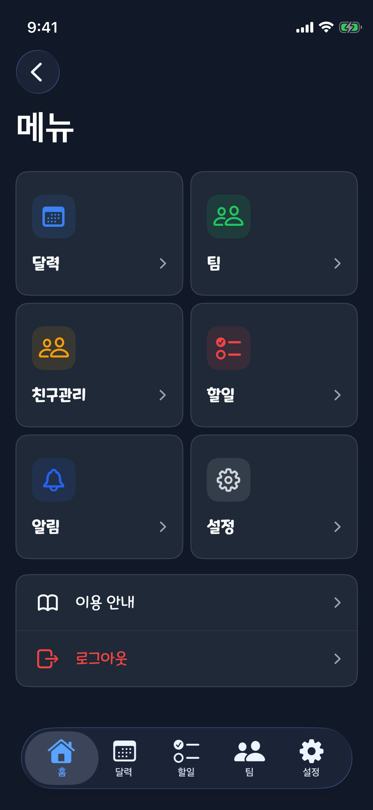 |

- 웹 `/guide`와 iOS `GuideWebView(.guide)`가 같은 이용 안내 화면을 여는데도 iOS에서만 `사용 가이드`로 표시되던 문구를 Root 전용 키로 분리해 `이용 안내`로 복원했다.
- 영어는 양쪽 모두 `Guide`여서 유지했고, 설정 화면의 네이티브 전용 `사용 가이드` 문구는 변경하지 않았다.
- iPhone 13 mini에서 Root 현지화 테스트 3건과 실제 햄버거 메뉴 UI 테스트 1건이 통과했다. 결과: `/tmp/Dutypark-RootGuideParity-20260815.xcresult`.
- 캡처에서 `이용 안내`가 잘림 없이 보이고 기존 `사용 가이드`가 사라졌으며 아이콘·행 높이·화살표·테두리도 정상임을 확인했다.

### 기본 근무 패턴 목록 UI — `b7bdc8ae`

| 웹 패턴 편집 | 웹 근무 선택 | iOS 수정 후 |
| --- | --- | --- |
|  |  |  |

- 웹처럼 7개 요일 칩을 먼저 표시하고 선택한 요일의 근무 행만 노출한다.
- 근무 행에 색상, 이름, 선택 상태와 펼침 표시를 함께 보여준다.
- 신규 패턴은 웹과 동일하게 월~금 및 첫 근무유형을 기본값으로 사용한다.
- `적용 시작`, `패턴 해제` 등 앱 언어를 따르지 않던 문자열을 함께 교정했다.
- 패턴 저장·해제는 공통 중앙 확인 패널을 사용하며 iPhone 13 mini UI 캡처를 통과했다.

### 숨김 근무유형이 포함된 기본 패턴 — `4ba4ab07`

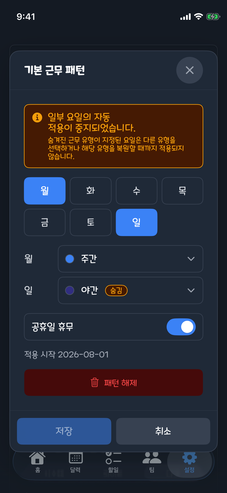

- 숨겨진 근무유형이 기존 패턴에 남으면 자동 적용과 저장이 중지되지만, 기존 iOS는 저장 버튼만 비활성화해 원인과 해결 방법을 알 수 없었다.
- 설정 카드와 편집 모달에 웹과 같은 경고 제목·설명을 표시하고, 해당 근무유형에는 `숨김` 배지와 접근성 설명을 추가했다.
- 보이는 근무유형으로 다시 선택하면 경고 상태가 해제되고, 숨김 선택이 남아 있을 때만 저장 차단을 유지한다.
- generic 앱 빌드와 `SettingsFeatureTests` 32/32가 통과했다. iPhone 13 mini UI 테스트 1/1에서 경고 전문, `야간`의 `숨김` 배지, 비활성 저장 버튼과 footer가 잘림·겹침 없이 표시됨을 확인했다: `/tmp/Dutypark-HiddenPattern-Unit.xcresult`, `/tmp/Dutypark-HiddenPattern-UI.xcresult`.

### 앱 언어 override — `2cdc26ea`

| 한국어 메뉴 | 한국어 설정 |
| --- | --- |
|  |  |

- SwiftUI의 `locale` 환경값과 별개로 기기 언어를 따라가던 Foundation 문자열 조회를 앱에서 선택한 `.lproj` bundle로 통일했다.
- 캘린더·설정 공통 문구, API 오류, 로그인 남은 횟수, OAuth 오류가 앱 언어를 따른다.
- 알 수 없는 시스템 인증 오류의 영문 `localizedDescription`을 그대로 노출하지 않고 앱 언어의 일반 오류로 대체한다.
- 앱 언어 한국어·기기 언어 영어 조합의 회귀 테스트를 통과했다.

### 설정 첫 화면 카피 동등성 — `4d8b9de3`

| 모바일 웹 기준 | iOS 수정 후 |
| --- | --- |
|  | 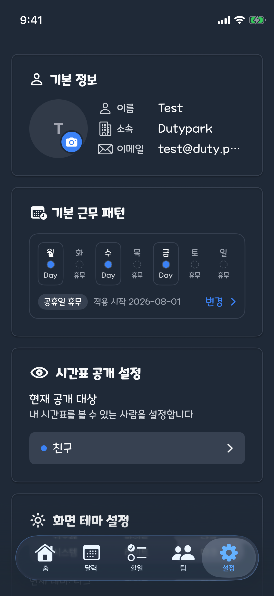 |

- 동일한 공개 범위 API를 사용하는 화면인데도 iOS에서 `캘린더 공개 범위`라고 부르던 제목을 웹과 같은 `시간표 공개 설정`으로 복원했다.
- `내 정보`는 `기본 정보`, `언어 및 화면`은 `화면 테마 설정`으로 맞췄고, 푸시 알림·AI 시간 인식·관리 위임·세션·소셜 연동·회원정보 섹션의 한·영 카피도 웹 카탈로그와 동일하게 정리했다.
- 네이티브에만 있는 권한·상태·안내 문구는 비교 대상에서 제외해 iOS 고유 동작은 유지했다.
- exact ko/en 회귀 테스트와 generic 앱·테스트 빌드가 통과했다.
- iPhone 13 mini에서 `기본 정보`, `시간표 공개 설정`, 설명, `화면 테마 설정`이 잘림·겹침 없이 표시되는 것을 확인했다. 결과: `/tmp/Dutypark-SettingsOverviewVisual-20260815-1554.xcresult`.

### 팀 월 이름 현지화 — `3987ea66`

| 웹 기준 | iOS 수정 후 연월 선택 |
| --- | --- |
|  | 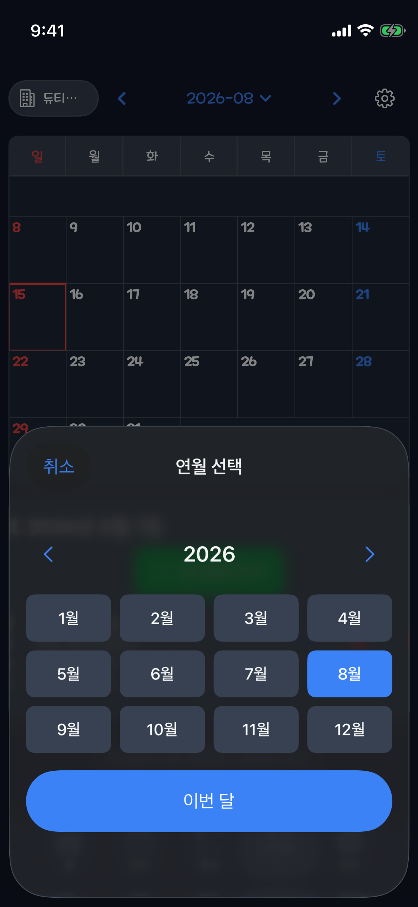 |

- 기기 캘린더의 `monthSymbols`를 직접 사용하던 코드를 앱 locale 기반 `DateFormatter`로 교체했다.
- 앱 한국어·기기 영어에서는 `8월`, 앱 영어에서는 `August`가 되는 회귀 테스트를 통과했다.
- 가입 팀 fixture에서 연월 선택기를 열어 `1월`부터 `12월`, 선택된 `8월`, `이번 달`을 직접 확인했다.

### 팀 달력 요일 앱 언어 — `3f9fe25a`

| 모바일 웹 기준 | iOS 수정 후 |
| --- | --- |
| 현재 앱 언어로 `일 월 화 수 목 금 토` 표시 |  |

- 모바일 웹은 선택한 앱 locale로 요일을 생성하지만 iOS는 `Calendar.current`의 기기 locale을 사용해 한국어 앱·영어 기기에서 `Sun, Mon…`이 표시될 수 있었다.
- 팀 달력의 요일 생성에 `AppLocalization.locale`을 적용해 기기 설정과 앱 언어를 분리했다.
- 한국어·영어 exact 단위 테스트와 generic test build가 통과했다.
- iPhone 13 mini를 기기 언어 영어(`en_US`), 앱 언어 한국어로 실행한 UI 테스트 1/1에서 `일 월 화 수 목 금 토` 전부와 `Sun`·`Mon` 부재를 확인했다. 육안으로도 균등 정렬과 잘림·겹침이 없었다: `/tmp/Dutypark-TeamWeekday-Green/Logs/Test/Test-Dutypark-2026.08.15_17-20-40-+0900.xcresult`, `/tmp/Dutypark-TeamWeekday-UI-Final-20260815.xcresult`.

### 팀 빈 근무 영역 오안내 — `9b37abb7`

| 수정 전 | iOS 수정 후 |
| --- | --- |
| 실제 일정 카드 아래 근무 영역에서도 `이 날의 팀 일정이 없습니다.`를 다시 표시 | 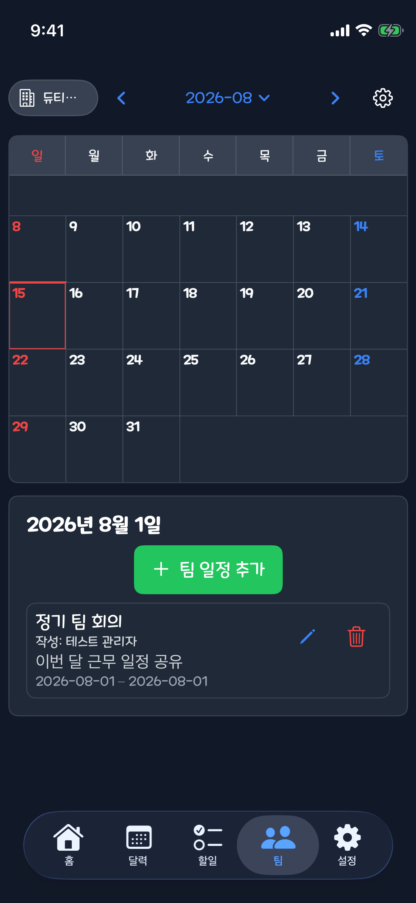 |

- iOS는 해당 날짜의 근무 배정이 없을 때 근무 영역에서 일정 전용 빈 문구를 재사용해, 실제 `정기 팀 회의`가 있는데도 `이 날의 팀 일정이 없습니다.`라고 잘못 안내했다.
- 모바일 웹과 동일하게 근무 배정 목록이 비면 해당 근무 영역 자체를 렌더하지 않고, 일정 빈 문구는 실제 일정 목록이 비었을 때만 유지한다.
- generic 앱·테스트 빌드와 `TeamFeatureTests` 27건이 통과했다. iPhone 13 mini UI 테스트 1/1에서 `정기 팀 회의` 카드가 남고 거짓 빈 문구가 존재하지 않음을 확인했다: `/tmp/Dutypark-TeamEmptyShift-TeamSuite-Built.xcresult`, `/tmp/Dutypark-TeamEmptyShift-UI.xcresult`.

### 팀 근무 인원 단위 — `1153345a`

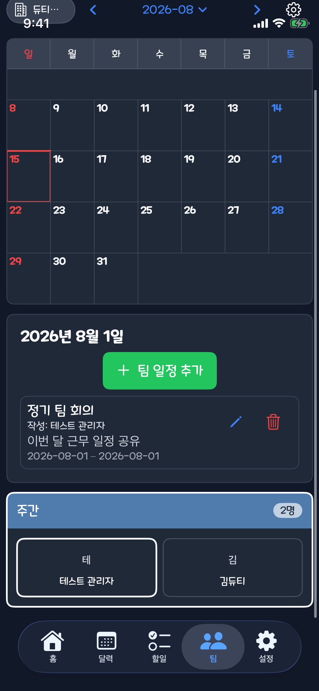

- 모바일 웹은 근무 인원을 `3명`처럼 표시하지만 iOS는 숫자만 `3`으로 보여 배지가 무엇을 세는지 알기 어려웠다.
- 이미 존재하던 공유 현지화 키를 실제 배지에 연결해 한국어 `3명`, 영어 `3 people`로 표시한다.
- 기존 빈 근무 fixture를 보존하고 전용 opt-in fixture에서만 두 명의 근무 카드를 구성해 다른 회귀 테스트의 의미를 유지했다.
- exact 한·영 테스트와 generic test build가 통과했다. iPhone 13 mini UI 테스트 1/1에서 `주간` 헤더의 `2명` 배지와 두 팀원 카드가 잘림·겹침 없이 표시되는 것을 확인했다: `/tmp/Dutypark-TeamShiftCount-Unit-20260815.xcresult`, `/tmp/Dutypark-TeamShiftCount-UI-Final-20260815.xcresult`.

### 관리자 활성 세션 상태 — `e34d67c4`

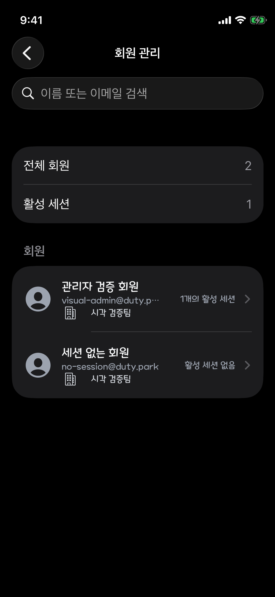

- 모바일 웹은 회원별 상태를 `N개의 활성 세션` 또는 `활성 세션 없음`으로 구분하지만 iOS는 `N개`만 표시해 숫자의 의미를 알기 어려웠고, 빈 상태도 `0개`로 노출했다.
- 같은 회원 DTO의 세션 수를 유지하면서 한국어는 `N개의 활성 세션` / `활성 세션 없음`, 영어는 `N active sessions` / `No active sessions`로 분기했다.
- exact 한·영 테스트와 generic test build가 통과했다. iPhone 13 mini UI 테스트 1/1에서 세션이 있는 회원과 없는 회원의 두 문구가 한 화면에 완전히 표시되고 잘림·겹침이 없음을 확인했다: `/tmp/Dutypark-AdminActiveSession-Unit-20260815.xcresult`, `/tmp/Dutypark-AdminActiveSession-UI-20260815.xcresult`.

### 달력·팀 비교 기준 확장 — `58cbf120`

| 화면 | 모바일 웹 | iOS |
| --- | --- | --- |
| 달력 |  |  |
| 팀 |  |  |

- 달력은 웹과 iOS fixture의 일정·D-Day 데이터가 달라 데이터 개수는 판정에서 제외하고 월 그리드와 네비게이션 기준으로 보존한다.
- 팀은 웹이 가입 팀, iOS가 미가입 fixture라 현재 직접 비교할 수 없다. 같은 팀 fixture를 제공한 뒤 연월 선택기와 팀 일정 UI를 판정한다.
- 확장 캡처는 홈·Todo·달력·팀·메뉴·설정·패턴 편집·패턴 해제 확인 8개 화면을 한 흐름에서 검증한다.

### 달력 월 그리드 상단 공백 — `a0aea3a8`

| 모바일 웹 기준 | iOS 수정 전 | iOS 수정 후 |
| --- | --- | --- |
|  |  | 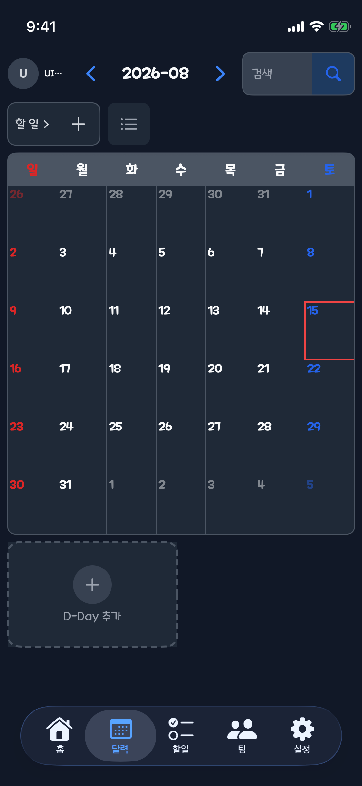 |

- 근무 요약, 친구 비교, 빠른 편집, 근무표 가져오기 액션이 모두 없는 달에도 44pt 높이의 빈 `dutyToolbar`가 렌더링되어 그리드가 아래로 밀렸다.
- 표시할 요약이나 액션이 하나라도 있거나 빠른 편집 중일 때만 도구행을 유지하고, 완전히 비어 있으면 생략하도록 했다.
- focused 정책 테스트와 generic test build가 통과했다.
- iPhone 13 mini 캡처에서 월 그리드가 `할 일` 행 바로 아래로 올라오고 불필요한 빈 행이 사라진 것을 확인했다. 결과: `/tmp/Dutypark-CalendarTopGap-Visual.xcresult`.

### 달력 일정 검색 범위 문구 — `83ea522e`

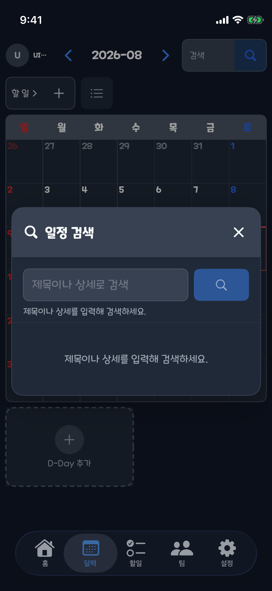

- 모바일 웹은 제목과 상세 내용을 모두 검색하므로 `제목이나 상세로 검색` / `Search by title or details`라고 안내하지만 iOS placeholder는 제목만 검색하는 것처럼 축약되어 있었다.
- iOS 검색 결과 안내는 이미 제목·상세를 언급하고 있어 같은 화면 안에서도 모순이었다. placeholder의 한·영 값만 실제 기능 및 웹과 맞췄다.
- exact ko/en 테스트와 iPhone 13 mini UI 1/1이 통과했다. 긴 한국어 placeholder가 한 줄로 완전 노출되고 검색 버튼과 겹치지 않음을 확인했다.
- 결과: `/tmp/Dutypark-CalendarSearch-Green-20260815.xcresult`, `/tmp/Dutypark-CalendarSearch-UI-20260815.xcresult`.

### 중앙 확인 UI — `de46f754`, `b7bdc8ae` 및 후속 적용 커밋

| 웹 기준 | iOS 수정 후 |
| --- | --- |
|  |  |

- 터치 지점이나 OS에 따라 위치가 달라지는 `confirmationDialog` 대신 화면 중앙의 공통 확인 패널을 추가했다.
- 제목, 영향 범위 설명, 취소 및 destructive 동작을 한 패널에서 명확히 보여준다.
- 기본 패턴 해제는 iPhone 13 mini UI 테스트에서 중앙 표시와 한국어 문구를 확인했다.
- 알림 삭제(`92f3fa66`)와 첨부 삭제(`def118e2`)에도 같은 패널을 적용했다. 삭제 대상 fixture를 추가해 알림은 `da97937c`, 첨부는 `28bfcbed`에서 별도 캡처했다.
- 관리자 팀 삭제와 회원 세션 종료(`2316075a`)도 중앙 패널로 통일했다. 진행 중에는 취소·외부 닫기·중복 제출을 막고, 세션 종료 패널에는 회원·기기·브라우저·IP 범위를 표시한다.

### 알림 드롭다운 닫기 정책 — `a72a15ca`

| 모바일 웹 기준 | iOS 수정 후 |
| --- | --- |
| 불러온 알림 목록을 닫을 때 확인한 미읽음을 모두 읽음 처리 | 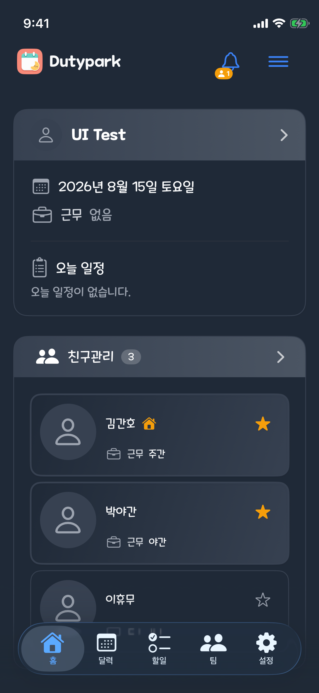 |

- 모바일 웹은 알림 목록 로드가 성공하면 드롭다운을 닫을 때 전체 읽음 처리하지만 iOS는 단순히 overlay만 숨겨 종 아이콘의 미읽음 배지와 행 강조가 계속 남았다.
- 배경 탭, VoiceOver escape, 전체보기 이동, 알림 행 라우팅을 공통 닫기 경로로 묶고, 화면에 표시된 로드가 성공했으며 미읽음이 있을 때만 전체 읽음 처리한다.
- 로딩·로드 실패·이미 읽음 상태에서는 요청하지 않고, 처리 중 중복 `markAllAsRead` 호출도 차단한다. API 실패 시 기존 상태를 유지한다.
- focused 정책·중복 요청 테스트와 generic 앱·테스트 빌드가 통과했다. iPhone 13 mini UI 테스트 1/1에서 드롭다운 닫힘과 빨간 미읽음 `1` 배지 제거를 확인했고, 별도 주황색 친구 요청 `1` 배지는 그대로 유지되어 범위도 정확했다: `/tmp/Dutypark-NotificationClose-Focused-20260815.xcresult`, `/tmp/Dutypark-NotificationClose-UI-Retry-20260815.xcresult`.

### 알림 드롭다운 작성자 아바타 — `0d16412b`

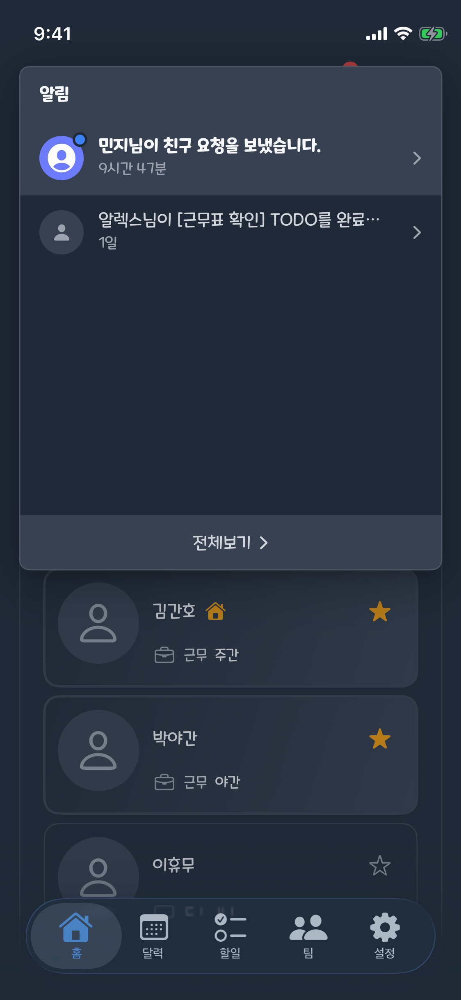

- 모바일 웹과 iOS 전체 알림 화면은 작성자 프로필 사진을 표시하지만, iOS 드롭다운만 payload와 무관하게 항상 `person.fill` 기본 아이콘을 사용했다.
- 작성자 ID와 프로필 사진 여부가 있을 때 전체 알림 화면과 같은 thumbnail/version API 계약으로 사진을 불러오며, 사진이 없거나 로드에 실패하면 기존 기본 아바타를 유지한다.
- endpoint·query·fallback 단위 테스트 3/3과 generic 앱·테스트 빌드가 통과했다. iPhone 13 mini UI 테스트 1/1에서 사진이 있는 첫 행과 fallback인 둘째 행, 미읽음 배지·텍스트·chevron이 한 화면에서 잘림 없이 표시됨을 확인했다: `/tmp/Dutypark-NotificationAvatar-Unit-20260815.xcresult`, `/tmp/Dutypark-NotificationAvatar-UI-Final-20260815.xcresult`.

### 관리자 팀 삭제·회원 세션 종료 — `2316075a`, `aaca282c`, `eee695a9`

| 관리자 팀 삭제 | 회원 세션 종료 |
| --- | --- |
| 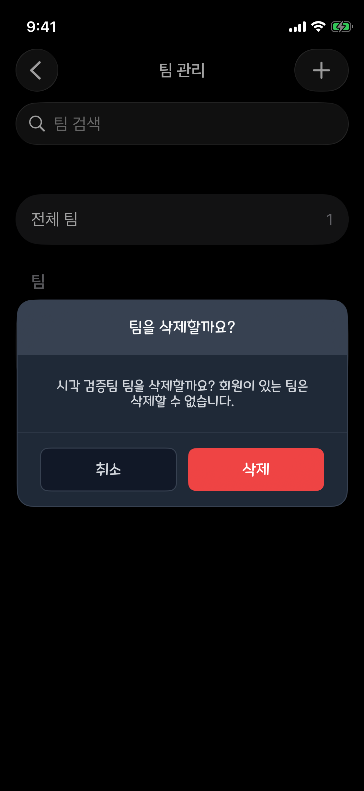 | 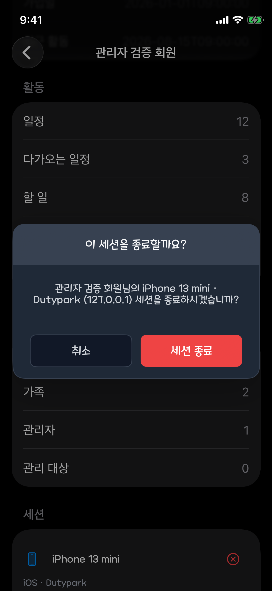 |

- DEBUG 관리자 fixture로 회원이 있는 팀 삭제와 iPhone 세션 종료 경로를 직접 열었다.
- 최초 세션 종료 캡처에서 긴 확인 문구가 취소 버튼 영역을 침범해, 접근성 트리에는 존재하지만 실제 픽셀에서 `취소`가 가려지는 공통 회귀를 발견했다.
- 공통 패널의 label뿐 아니라 Button 자체에도 균등 폭을 강제해 취소·확인 버튼의 동일 폭과 간격을 복원했다.
- 강화한 `isHittable`·비중첩·동일폭 assertion과 crop 육안 검수까지 통과했다.
- iPhone 13 mini UI 테스트 2/2 통과: `/tmp/Dutypark-AdminConfirmationVisual-Final-20260815.xcresult`.

### 알림 삭제 확인 — `92f3fa66`, `da97937c`

| 개별 알림 삭제 | 읽은 알림 일괄 삭제 |
| --- | --- |
|  | 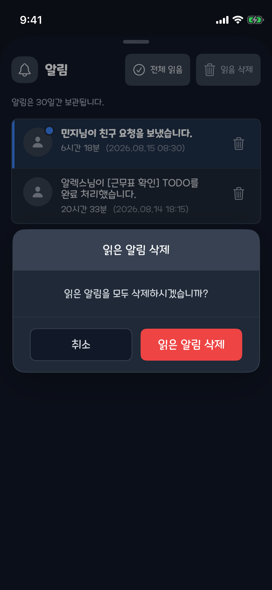 |

- 읽은 알림 1건과 안 읽은 알림 1건을 제공하는 DEBUG 전용 fixture로 두 destructive 경로를 검증했다.
- 첫 캡처에서는 한 테스트 안에서 첫 cover를 닫자마자 두 번째 cover를 열어 전환 중간 프레임이 저장되는 문제를 발견했다.
- 두 흐름을 각각 새 앱 launch로 분리하고, 제목·본문·버튼 문구, 44pt 터치 영역, 비중첩, 화면 bounds와 4회 연속 프레임 안정성을 통과한 뒤 캡처한다.
- iPhone 13 mini UI 테스트 2/2 통과: `/tmp/Dutypark-NotificationVisualStability-20260815.xcresult`.

### 첨부파일 삭제 확인 — `def118e2`, `3bef215b`, `28bfcbed`

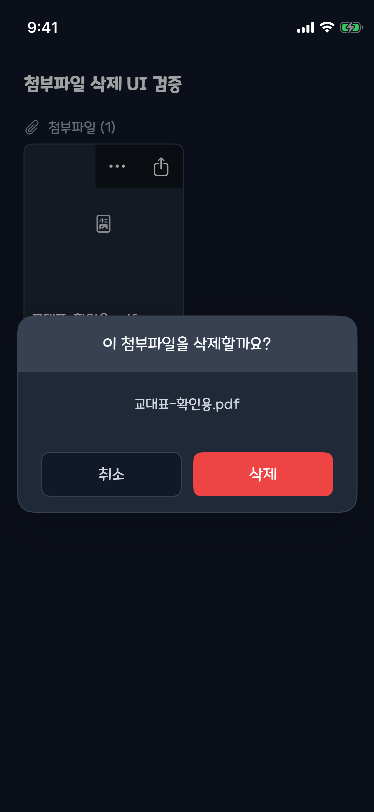

- 고정 PDF fixture에서 카드의 더보기 메뉴를 열고 삭제를 선택하는 실제 경로를 검증했다.
- 패널은 대상 파일명, 취소·삭제 버튼을 같은 폭으로 표시하며 화면 중앙에 배치된다.
- direct route와 fixture는 `#if DEBUG`로 한정했고 Release 빌드에서도 제거된 상태로 컴파일되는 것을 확인했다.
- iPhone 13 mini UI 테스트 1/1 통과: `/tmp/Dutypark-AttachmentVisual-20260815-04.xcresult`.

### 설정 계정·프로필 확인 — `84047661`

| 웹 설정 기준 | 프로필 사진 삭제 | 설정 로그아웃 |
| --- | --- | --- |
|  | 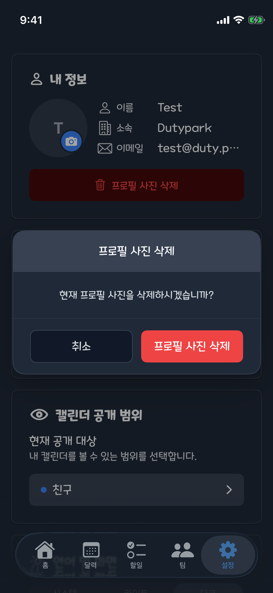 | 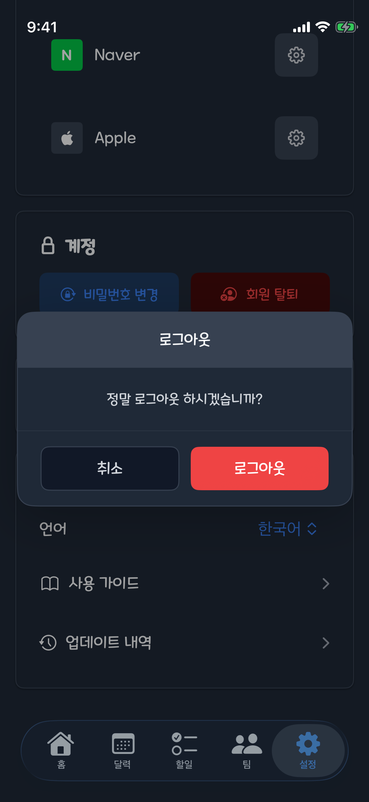 |

- 프로필 사진 삭제, 로그아웃, 관리자 해제, 관리 계정 전환, 세션 종료를 공통 중앙 패널로 통일했다.
- 세션 종료는 웹처럼 기기·브라우저·IP를 영향 범위에 포함한다.
- 작업 중에는 중복 실행과 배경·gesture dismiss를 차단한다.
- iPhone 13 mini에서 `SettingsFeatureTests` 29건과 전용 시각 UI 테스트 3건이 통과했다.
- `22d0bc18`에서 프로필 사진 fixture와 안정적인 접근성 식별자를 추가했고, 두 확인 패널의 제목·설명·취소·destructive 버튼 및 중앙 배치를 직접 확인했다.

### 회원 탈퇴 영구 삭제 문구 — `12974a63`

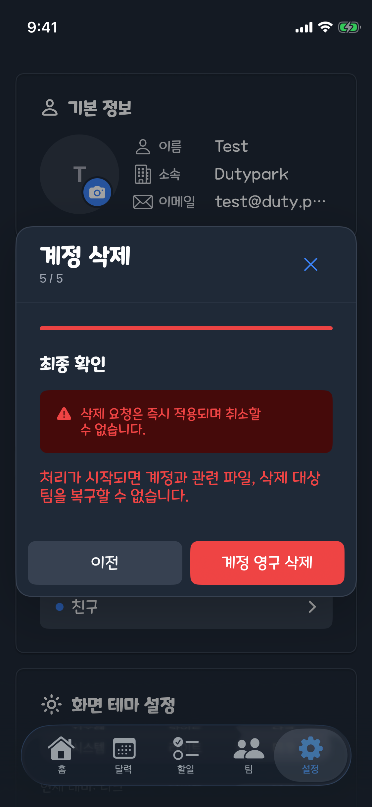

- 모바일 웹의 최종 destructive 동작은 `계정 영구 삭제` / `Permanently delete account`로 비가역성을 버튼 자체에 명시하지만 iOS는 `내 계정 삭제` / `Delete my account`로 축약되어 있었다.
- 한·영 문구를 웹과 exact 일치시켰으며 삭제 영향·복구 불가 안내와 기존 5단계 확인 흐름은 유지했다.
- DEBUG fixture는 삭제 요청을 항상 거부하고, UI 테스트도 최종 버튼을 누르지 않은 채 문구·44pt 높이·완전 노출·비중첩만 검증한다.
- iPhone 13 mini에서 AccountDeletion 테스트 9/9와 UI 1/1이 통과했다. 결과: `/tmp/Dutypark-AccountDeletionCopy-Unit-Green-20260815.xcresult`, `/tmp/Dutypark-AccountDeletionCopy-UI-Final-20260815.xcresult`.

### Todo 카드 상호작용과 destructive 확인 — `bd3a1fc4`, `b84b2478`

| 웹 Todo 기준 | iOS 작성 취소 | iOS Todo 삭제 |
| --- | --- | --- |
|  | 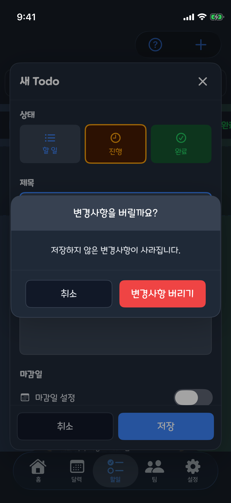 | 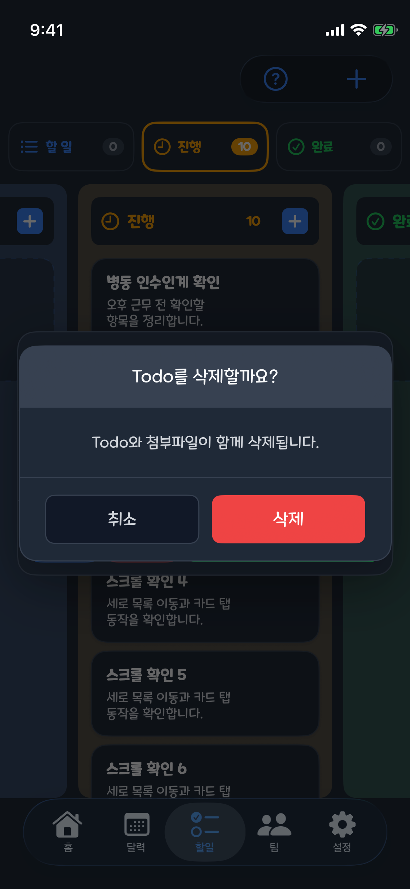 |

- 작성·수정 변경사항 폐기, Todo 삭제, 내 태그 해제를 중앙 확인 패널로 통일했다.
- 삭제 시 첨부파일도 함께 삭제되고, 태그 해제 시 보드에서 제거된다는 영향 안내는 유지했다.
- 후속 실제 경로 검증에서 선택 상태가 `진행 중`이어도 보드는 다른 열에 머물러 카드가 화면 밖에 놓이고, 기존 롱프레스 제스처가 일반 카드 탭을 막는 회귀를 발견했다.
- 보드가 나타나거나 상태가 바뀔 때 선택 열을 화면 중앙으로 정렬하고, iOS 18 이상에서는 SwiftUI 카드에 직접 연결한 UIKit 롱프레스 인식기와 일반 탭을 함께 사용한다. iOS 17 fallback은 기존 정책을 유지한다.
- DEBUG 전용 direct-open 우회 없이 실제 카드 탭 → 상세 → 삭제 경로와 0.5초 롱프레스 재정렬을 검증했다. 세로 스크롤은 상세를 열거나 순서를 바꾸지 않는다.
- iPhone 13 mini에서 `TodoViewModelTests` 32건과 UI 5/5가 통과했다. 결과: `/tmp/Dutypark-TodoFallbackPolicy-Unit-20260815.xcresult`, `/tmp/Dutypark-TodoGesture-TapLongPress-20260815.xcresult`, `/tmp/Dutypark-TodoGesture-Remaining-20260815.xcresult`.
- 두 확인 패널은 제목·본문·취소·destructive 버튼이 모두 표시되고, 버튼 겹침 없이 화면 중앙에 배치되는 것을 원본 PNG와 독립 crop으로 확인했다.

### Todo `진행중` 문구 — `73fe7e0a`

| 모바일 웹 기준 | iOS 수정 후 |
| --- | --- |
|  | 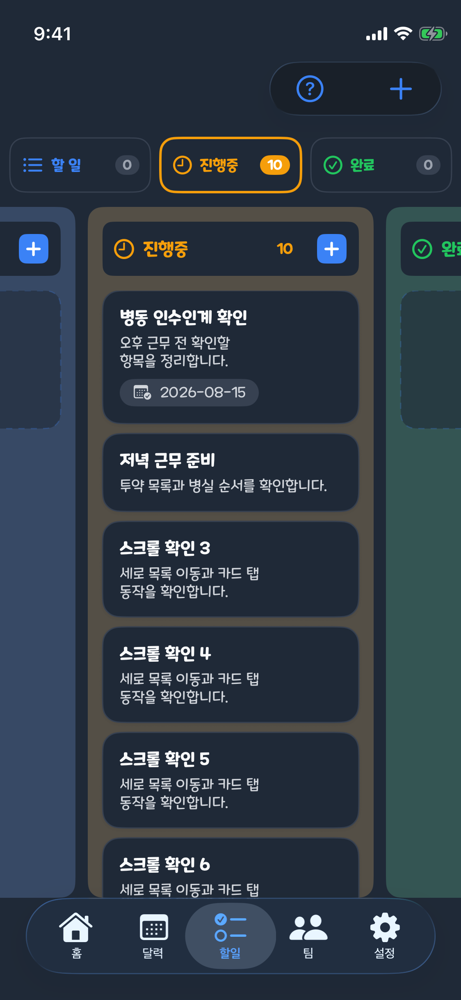 |

- 모바일 웹의 상단 상태 탭과 보드 열은 모두 `진행중`인데 iOS만 `진행`으로 축약되어 있었다.
- 양쪽 iOS 노출 위치가 공유하는 short status 키의 한국어 값만 `진행중`으로 복원했다. 영어 `Doing`은 웹과 이미 같아 유지했다.
- exact ko/en 단위 테스트와 iPhone 13 mini UI 테스트 1/1이 통과했다. 실제 화면에서 `진행중`이 두 곳 이상 표시되고 구형 `진행`은 남지 않음을 확인했다.
- 결과: `/tmp/Dutypark-TodoCopy-GREEN-20260815.xcresult`, `/tmp/Dutypark-TodoCopy-Visual-20260815.xcresult`.

### 팀 일정·관리 확인 — `2ecdbb70`

| 웹 팀 기준 | 일정 삭제 | 구성원 제외 |
| --- | --- | --- |
|  | 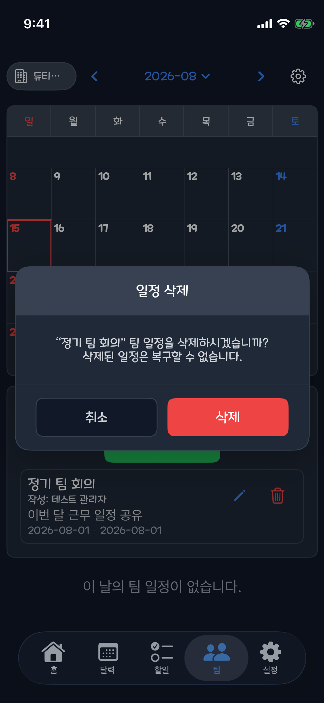 | 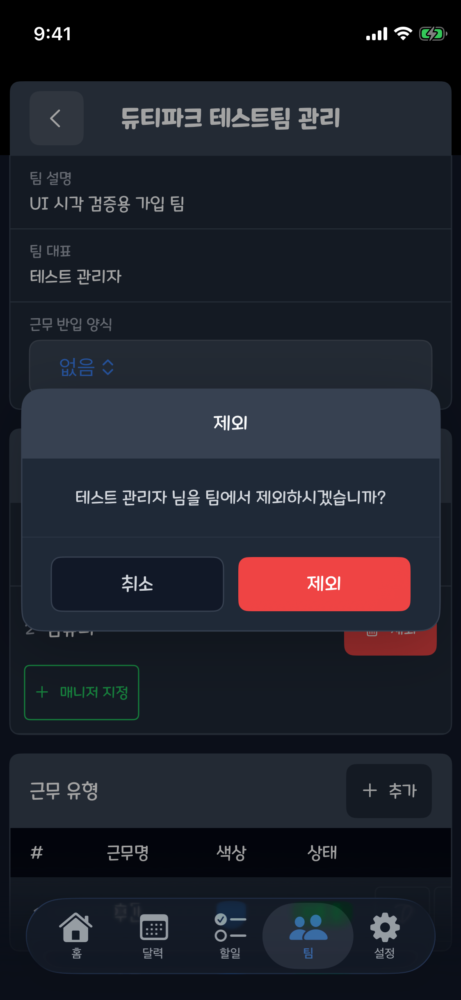 |

- 팀 일정 삭제에 일정 제목과 복구 불가 영향을 표시하고 중앙 패널로 통일했다.
- 멤버 제외, 권한 변경, 관리자 위임·초기화, 멤버 추가, 근무유형·업로드 변경사항 폐기도 같은 패턴을 사용한다.
- iPhone 13 mini에서 `TeamFeatureTests` 24건이 모두 통과했다.
- `d444f095`의 가입 팀 fixture에서 실제 일정 삭제와 팀 관리 구성원 제외 패널을 캡처했다.
- 제목·대상·영향 문구·버튼 중앙 배치를 확인하고, 취소 후 패널 소멸과 앱 foreground 유지까지 검증했다.
- iPhone 13 mini UI 테스트 3/3 통과: `/tmp/Dutypark-TeamParityVisual-20260815-03.xcresult`.

### 팀 대표 취소 대상 문구 — `76e0f25f`

| 모바일 웹 기준 | iOS 수정 후 |
| --- | --- |
| 대표 취소 확인에 현재 대표 이름을 포함 | 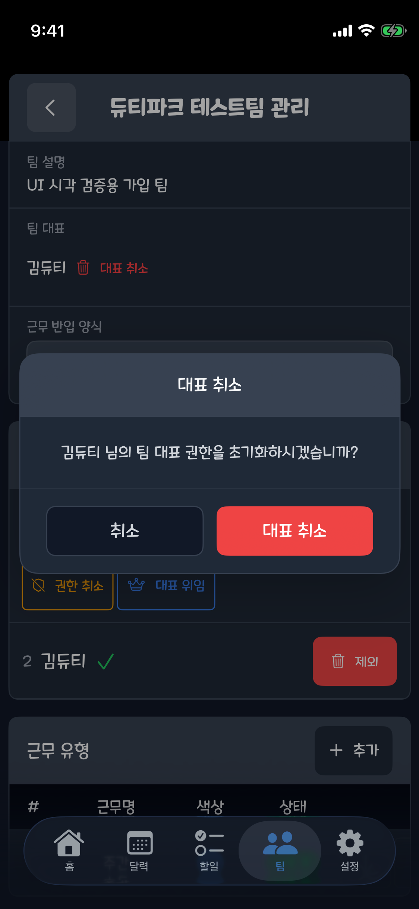 |

- 모바일 웹은 권한을 초기화할 대표의 이름을 확인 문구에 포함하지만 iOS는 `팀 대표를 초기화하시겠습니까?`라고만 표시해 대상을 알기 어려웠다.
- 팀의 `adminId`로 현재 대표 멤버를 찾아 `김듀티 님의 팀 대표 권한을 초기화하시겠습니까?`처럼 표시하며, 멤버 정보를 찾지 못할 때는 현지화된 기존 일반 문구로 안전하게 대체한다.
- 기존 중앙 확인 패널과 처리 중 중복 제출·외부 dismiss 차단은 유지했고, UI 테스트에서는 파괴적 확인 버튼을 누르지 않았다.
- 포맷·fallback 단위 테스트 2건과 generic 앱·테스트 빌드가 통과했다. iPhone 13 mini UI 테스트 1/1 통과 및 육안 검수 결과 제목·본문·취소·대표 취소 버튼이 모두 중앙에 잘림·겹침 없이 표시됐다: `/tmp/Dutypark-TeamLeadTarget-Green/Logs/Test/Test-Dutypark-2026.08.15_17-01-18-+0900.xcresult`, `/tmp/Dutypark-TeamResetLead-Final-20260815.xcresult`.

### Root 로그아웃 확인 — `8a6a3aae`

| 로그아웃 진입점 | 중앙 확인 패널 |
| --- | --- |
|  | 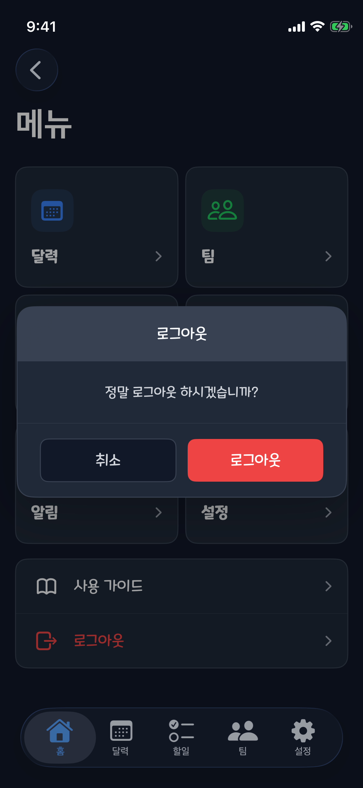 |

- 햄버거 메뉴의 로그아웃 native `confirmationDialog`를 중앙 패널로 교체했다.
- 로그아웃 처리 중에는 재실행, 취소, 배경 탭, gesture dismiss를 차단한다.
- 링크 미지원 같은 정보 alert는 기존 방식으로 유지했다.
- iPhone 13 mini에서 전용 정책·소스 테스트 3건이 통과했다: `/tmp/dutypark-root-logout-20260815.xcresult`.
- `22d0bc18`의 전용 UI 테스트에서 실제 메뉴 진입 후 패널 중앙 배치와 한국어 버튼을 검증했으며, 전환 안정화 후 최종 스크린샷을 보존했다.

### 달력 월 일괄 변경 — `c47a77ea`, `f390c6bc`

| 모바일 웹 달력 기준 | iOS 월 일괄 변경 중앙 선택 |
| --- | --- |
|  | 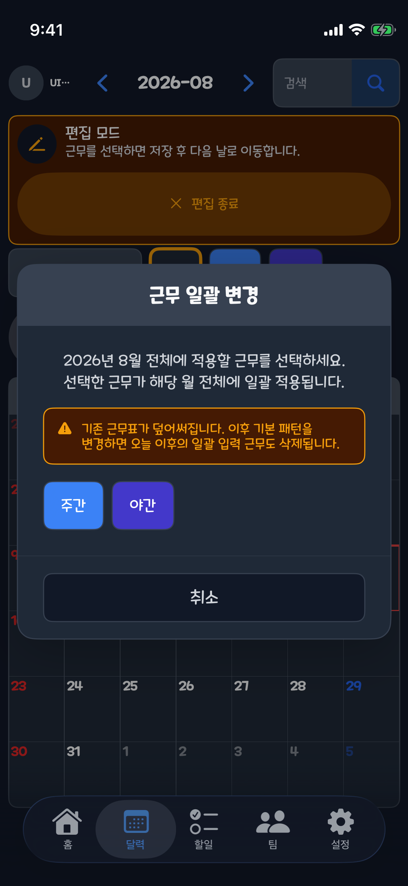 |

- 빠른 근무 편집에서 월 일괄 변경을 열어 주간·야간 선택, 덮어쓰기 경고, 취소 동작을 한 중앙 패널에서 확인했다.
- 최초 시각 검수에서 `String(format:locale:)`가 연도 `%d`를 `2,026`으로 그룹화하는 새 회귀를 발견했다.
- 번역 bundle은 앱 언어를 유지하고 캘린더 식별자·카운트 치환에는 `en_US_POSIX`를 사용해 `2026년 8월`로 복원했다.
- 수정 후 iPhone 13 mini UI 테스트 1건이 통과했고 `2026년 8월 전체에 적용할 근무를 선택하세요.`를 육안 확인했다: `/tmp/Dutypark-CalendarBatchVisual-YearFix-20260815.xcresult`.

### 소셜 계정 연결 해제 — `a19f4047`

| 연결 관리 | 연결 해제 중앙 확인 |
| --- | --- |
| 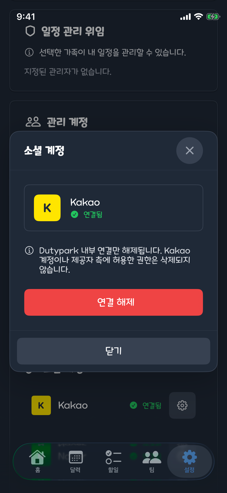 | 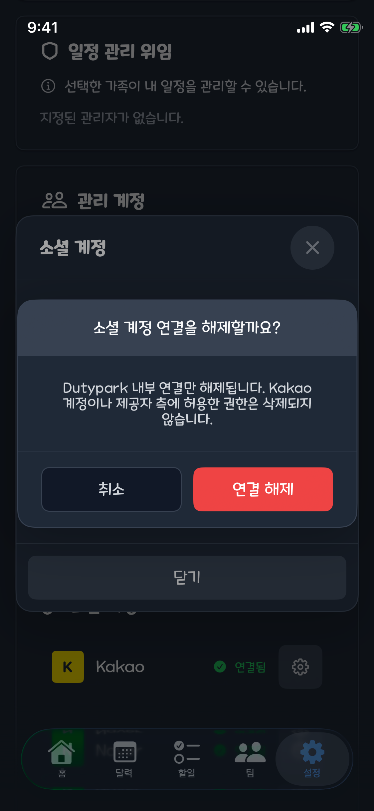 |

- 카카오·Google·Apple 연결 해제 native alert를 공통 중앙 패널로 교체했다.
- 처리 중에는 확인·취소·배경 탭·VoiceOver dismiss와 중복 제출을 차단한다.
- 연결 해제 오류 notice는 정보 alert로 유지했다.
- iPhone 13 mini에서 전용 테스트 3건이 통과했다: `/tmp/Dutypark-SocialConnectionManagementTests.xcresult`.
- `8c947a62`의 DEBUG fixture로 Kakao 연결 상태, 내부 연결만 해제된다는 영향 안내, 취소·연결 해제 버튼을 직접 검증했다.
- 시각 UI 테스트 1/1 통과: `/tmp/Dutypark-SocialConnectionVisual-20260815.xcresult`.

### Apple 연결 해제 정책 안내 — `54bc2c42`

| Apple 연결 관리 | Apple 연결 해제 중앙 확인 |
| --- | --- |
| 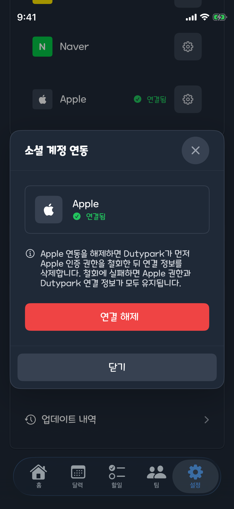 | 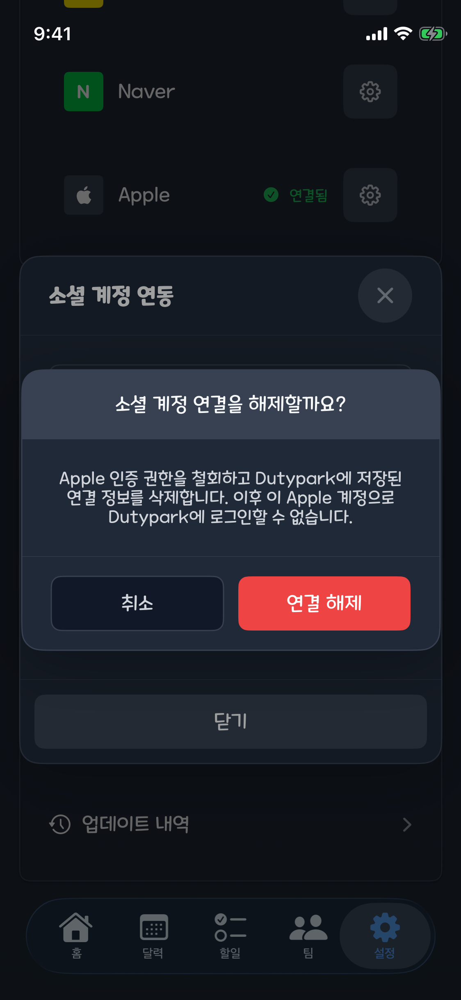 |

- 기존 iOS는 모든 공급자에 같은 문구를 사용해 Apple도 `제공자 측에 허용한 권한은 삭제되지 않습니다`라고 안내했지만, 실제 서버와 모바일 웹은 Apple 인증 권한을 먼저 철회한 뒤 로컬 연결 정보를 삭제한다.
- Apple 관리 화면에는 철회 후 삭제 순서와 철회 실패 시 양쪽 상태가 유지된다는 점을, 확인 패널에는 권한 철회·저장 연결 삭제·이후 해당 Apple 계정 로그인 불가 영향을 명시했다.
- Kakao와 Naver는 기존처럼 Dutypark 내부 연결만 해제하고 제공자 권한은 유지한다는 안내를 보존했다.
- exact 한·영 정책 테스트와 generic 앱·테스트 빌드가 통과했다. iPhone 13 mini UI 테스트 1/1에서 두 문구의 전체 노출, 정상 줄바꿈, 중앙 패널과 동일 높이·비중첩 버튼을 확인했다. 파괴적 확인은 누르지 않고 취소했다: `/tmp/Dutypark-AppleUnlink-Unit-Final-20260815.xcresult`, `/tmp/Dutypark-AppleUnlink-UI-Final2-20260815.xcresult`.

### SSO 추가정보 draft 폐기 — `cc673095`

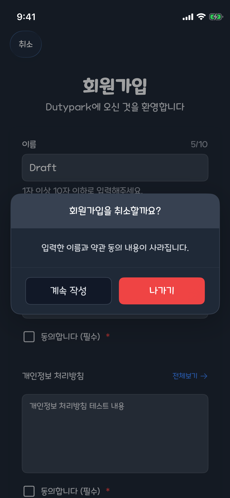

- 작성 중인 추가정보를 취소할 때 표시되던 native alert를 중앙 패널로 교체했다.
- 빈 draft는 즉시 닫고, 작성 내용이나 약관 선택이 있을 때만 확인한다.
- 처리 중에는 중복 제출·취소·배경·gesture dismiss를 차단한다.
- iPhone 13 mini에서 OAuth 가입 프레젠테이션 테스트 6건이 통과했다: `/tmp/Dutypark-SsoSignupConfirmation-20260815-01.xcresult`.
- DEBUG direct route에서 이름 draft를 입력한 뒤 취소해 정확한 제목·영향 문구·`계속 작성`·`나가기` 버튼을 검증했다.
- 시각 UI 테스트 1/1 통과: `/tmp/Dutypark-SsoSignupVisual-20260815-02.xcresult`.

### 게스트 이용 안내 제목 — `e60632a0`

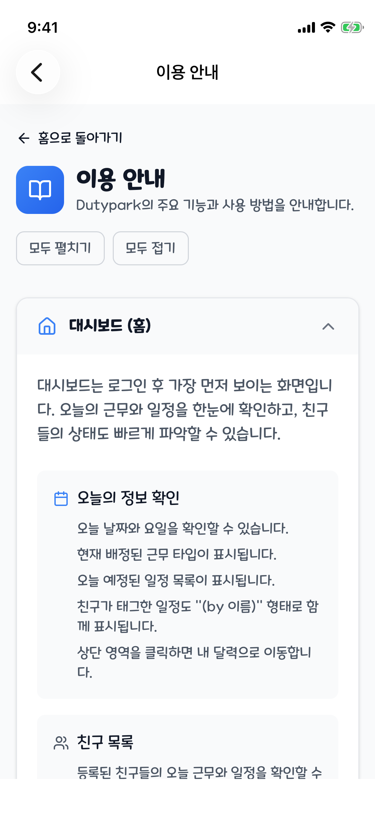

- 같은 화면에서 웹 본문은 `이용 안내`인데 네이티브 내비게이션 제목만 `이용 안내 및 릴리스 노트`로 표시되어 제목이 서로 달랐다.
- 게스트 전용 한·영 제목을 웹과 같은 `이용 안내` / `Guide`로 맞췄다. Root 메뉴와 Settings의 별도 가이드 키는 변경하지 않았다.
- exact 한·영 테스트와 generic 앱 빌드가 통과했다. iPhone 13 mini UI 테스트 1/1에서 상단 네이티브 제목과 웹 본문 제목이 모두 `이용 안내`로 표시되고 잘림·겹침이 없음을 확인했다: `/tmp/Dutypark-GuestGuideTitle-Green.xcresult`, `/tmp/Dutypark-GuestGuideTitle-UI3.xcresult`.

### 게스트 이용 안내의 네이티브 홈 복귀 — `6b69ce5a`

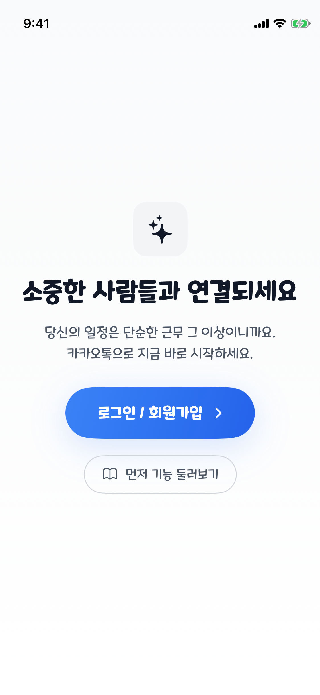

- 웹 본문의 `홈으로 돌아가기`를 누르면 기존 iOS는 같은 WebView 안에서 웹 홈을 열어 네이티브 이용 안내 내비게이션이 남았다.
- 게스트 가이드에서만 first-party `/` 이동을 가로채 native dismiss로 연결하고, Vue Router의 SPA 링크도 동일하게 처리했다. Settings의 가이드·릴리스 노트와 외부 링크 동작은 변경하지 않았다.
- generic 앱 빌드와 `GuestPublicLinkTests` 7/7이 통과했다. iPhone 13 mini UI 테스트 1/1에서 실제 웹 링크를 탭한 뒤 이용 안내 내비게이션이 사라지고 네이티브 게스트 CTA 화면으로 돌아오는 것을 확인했다: `/tmp/Dutypark-GuestGuideHome-Unit-20260815.xcresult`, `/tmp/Dutypark-GuestGuideHome-UI-Final-20260815.xcresult`.

### 게스트 공개 달력 연월 선택 — `41e1c184`

| 연월 선택기 | 먼 월 직접 이동 후 |
| --- | --- |
| 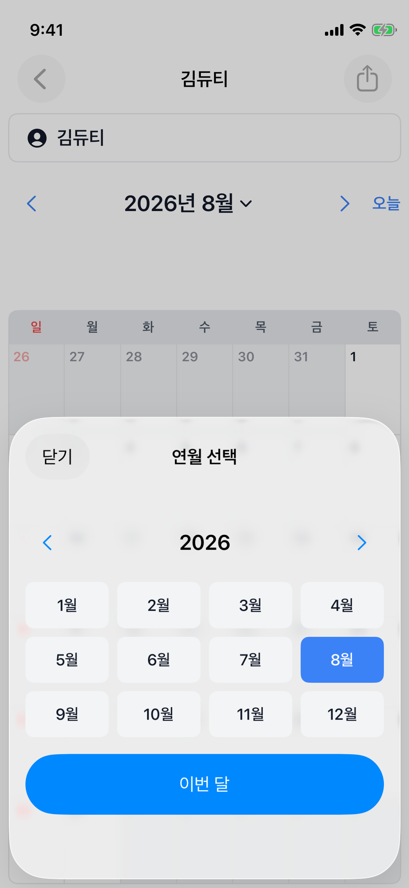 | 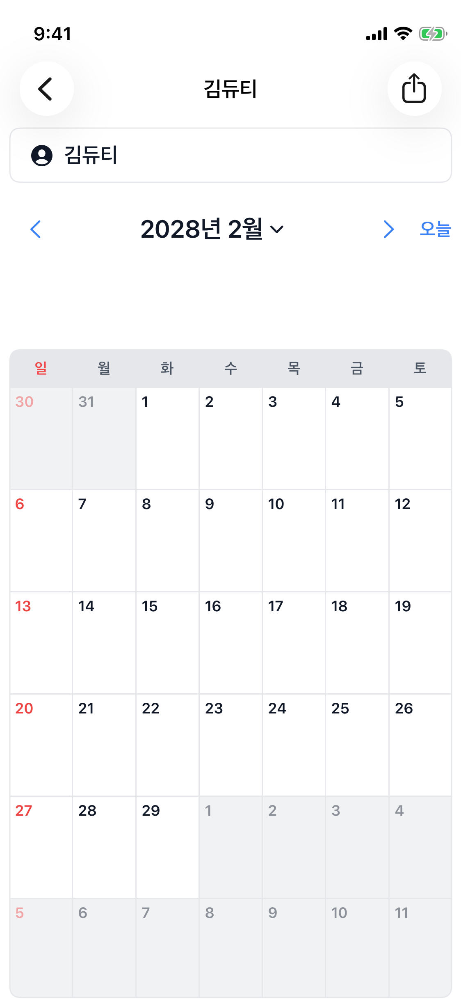 |

- 모바일 웹은 중앙 연월을 눌러 연도와 월을 직접 선택할 수 있지만 iOS 게스트 공개 달력은 이전·다음·오늘만 제공해 먼 월까지 한 달씩 반복 이동해야 했다.
- 중앙 연월을 버튼으로 바꾸고 연도 이동, 4×3 월 그리드, 이번 달 동작을 갖춘 native medium sheet를 추가했다. 선택한 먼 월은 기존 공개 달력 조회 경로로 다시 불러온다.
- 첫 시각 검증에서 locale 숫자 그룹화로 `2,028년`이 표시되는 문제도 발견해, 번역 선택과 숫자 치환을 분리해 `2028년 2월`로 바로잡았다.
- focused unit 3/3과 generic 앱·테스트 빌드가 통과했다. iPhone 13 mini UI 테스트 1/1에서 선택기 요소의 잘림·겹침 부재, 2026년 8월 선택 강조, 2028년 2월 직접 이동과 그리드 갱신을 확인했다: `/tmp/Dutypark-GuestMonthPicker-Unit-Final2-20260815.xcresult`, `/tmp/Dutypark-GuestMonthPicker-UI-Final2-20260815.xcresult`.

### 친구 destructive 확인과 관리 액션 — `38dc5bca`

| 친구 목록 | 친구 삭제 중앙 확인 |
| --- | --- |
|  | 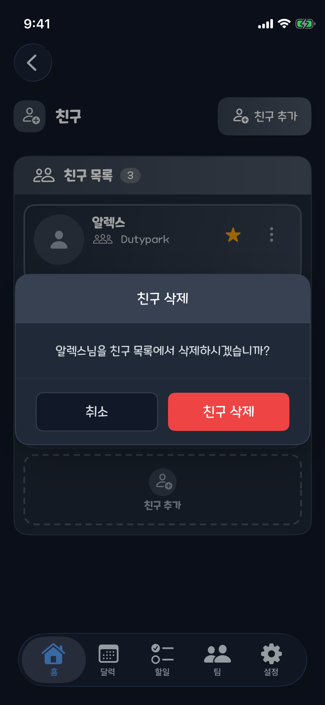 |

- 친구 요청 거절·보낸 요청 취소·가족 관계 해제·친구 삭제를 중앙 패널로 통일했다.
- `ellipsis.vertical`이 iOS 26.5에 없는 SF Symbol이라 버튼 frame이 `(inf, inf, 0, 0)`이 되던 원인을 찾아, 유효한 `ellipsis`를 90도 회전해 세로 점 모양과 44pt 터치 영역을 복원했다.
- 카드 본문 캘린더 열기, 별표, 더보기, 0.35초 롱프레스 재정렬 영역을 분리했다.
- `SocialFeatureTests` 19건, 친구 진입·재정렬 UI, 친구 삭제 중앙 패널 UI가 모두 통과했다.
- 결과: `/tmp/dutypark-social-hit-symbol-20260815-1020.xcresult`, `/tmp/dutypark-social-reorder-20260815-1021.xcresult`.

## 시각 회귀 자동화

`ParityVisualCaptureUITests`는 한국어·다크모드로 앱을 실행해 다음 화면을 순서대로 캡처한다.

- 대시보드
- Todo
- 달력
- 팀
- 햄버거 메뉴
- 설정
- 기본 근무 패턴
- 패턴 해제 중앙 확인

2026-08-15 실행 결과: 1개 테스트, 실패 0건, 약 36.6초.

## 미해결·다음 순서

- [x] 친구관리 상세 진입과 롱프레스 재정렬 시각·상호작용 검증
- [x] 헤더·탭·Root 메뉴 현지화 기능 커밋 및 시각 보고
- [x] 기본 근무 패턴 UI와 패턴 해제 중앙 확인 기능 커밋 및 시각 보고
- [x] 캘린더 월 일괄 변경 중앙 선택 화면 스크린샷 추가
- [x] 알림 삭제용 UI fixture와 중앙 패널 스크린샷 추가
- [x] 첨부 삭제용 UI fixture와 중앙 패널 스크린샷 추가
- [x] 관리자 팀 삭제·회원 세션 종료 UI fixture와 중앙 패널 스크린샷 추가
- [x] 설정 로그아웃·프로필 삭제 중앙 패널 스크린샷 추가
- [x] Todo 작성 취소·삭제 중앙 패널 스크린샷 추가
- [x] 팀 연월 선택기 한국어 스크린샷 추가
- [x] 가입 팀 fixture로 일정 삭제·관리 중앙 패널 스크린샷 추가
- [x] Root 햄버거 로그아웃 중앙 패널 스크린샷 추가
- [x] 소셜 연결 관리 fixture와 연결 해제 중앙 패널 스크린샷 추가
- [x] SSO 추가정보 fixture와 draft 폐기 중앙 패널 스크린샷 추가
- [x] 설정의 사진 삭제·관리자 해제·관리 계정 전환 확인 UI 조사 및 수정
- [x] 로그아웃 등 남은 전역 `confirmationDialog` 조사 및 수정
